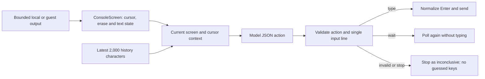

# Console-agent interaction

The agent now decides from a bounded, readable **current screen**, separately from recent action history. This fixes a failure where inventory redraws filled the beginning of the transcript, the current item prompt was omitted, and fallback `q` inputs were sent until the test timed out.

## Data flow

- `ConsoleScreen` keeps 120 columns by 30 rows, matching the runner's ConPTY size. It interprets common cursor movement, clear-screen, erase-line, carriage-return and backspace controls. Colors and terminal-title strings do not reach the model. Escape sequences can span output slices. The parser is a bounded text projection, not a complete terminal emulator; unsupported terminal modes and complex Unicode cell widths are not modeled.
- After a capture gap, the screen is marked potentially incomplete until a clear-screen sequence. The model receives the visible screen plus text near the cursor. Current context overrides old menus and earlier model reasoning.
- Recent history keeps its **tail**. Console output is no longer reduced to its first 800 characters before the agent sees it. The decision prompt also retains the tail if its context limit is reached. Blank screens between redraws are polled again without asking the model to type from old history.
- Replies must contain an explicit JSON action. `type` requires an explicit string input (or `stdin` alias); trailing line endings are removed and embedded control characters/multiple lines are rejected. An explicit empty string can represent Enter. Plain prose, malformed JSON and unsupported actions never become keystrokes.
- `wait` performs another observation without typing. `close` closes redirected stdin and ends interaction. Invalid replies or invalid input receive one correction attempt against the same screen before anything is written. If that also fails, the session stops as **inconclusive**. Explicit `stop` actions and failed model calls stop without retry. There is no fallback `q`, number or other guessed input. Runner termination does not become a student crash deduction.
- `ConsoleInputPolicy` converts an exact displayed menu label such as `1) Buy` into just its key (`1`), and validates options against the nearby menu. Item names remain text when the active prompt is not a menu. For a visible prompt whose C++ source shows `getline(cin, variable)` followed by `stoi(variable)`, it requires one integer rather than a space-separated batch. This is conservative source matching, not general type inference across every supported language.
- `ConsoleSourceContext` selects excerpts around input reads/conversions, including helpers near the end of the supplied source, instead of only its first 4,000 characters. The execution service resolves included companion headers from source files even when no files were checked in the UI. Source comments are identified as task data in the model instructions.
- A repeated question after a successfully sent answer does not count as a repeated-output failure. This allows loops that collect several scores. Continuous-output, turn and time budgets remain in place.
- ConPTY input uses carriage return for Enter, including when the model originally returned an LF-terminated string. Write failures are surfaced instead of swallowed.
- The 90-second agent budget now cancels pending decisions. Ollama requests receive that cancellation token too. Caller cancellation kills the running session and propagates to the caller.

The automated regressions use synthetic inventory/menu redraws and fake model decisions, plus real redirected/ConPTY processes and runner-protocol tests. They verify the interaction mechanics without sending student code to a model. They do not guarantee that a model chooses the right item or menu option for every assignment.

Rebuild/restart the desktop app for the host-side agent changes. Republish the guest runner for the ConPTY Enter normalization in Hyper-V. An already-running app keeps its loaded code until restarted.

## Ollama structured actions
Console decisions send an explicit JSON schema in Ollama's format field and use temperature 0. The schema requires action, input, reason, and observation; actions are limited to type, wait, close, and stop. Existing parsing, single-line checks, menu/source validation, and the bounded correction retry remain in place: valid JSON does not prove a correct decision. Ordinary feedback requests remain free text. Azure requests retain their existing prompt-based format. Unsupported Ollama schema requests stop inconclusively rather than silently falling back. Request-contract tests use a fake HTTP handler; live model quality must be evaluated separately.

Each model attempt has a 30-second deadline within the existing 90-second interaction budget. Live terminal status reports waiting, returned actions, correction retries, and cleanup. A model timeout cancels the request and stops the student process immediately; the report marks it inconclusive, separately from an overall session timeout. Slow cold starts can reach this limit. A stalled-provider regression verifies cancellation and cleanup even when the provider ignores cancellation.

The console agent also receives a separate history of the last 12 successfully sent inputs so screen redraws cannot erase its action history. Its prompt requests varied relevant paths and a normal displayed exit within the turn budget. This improves planning context but does not guarantee coverage or correct model choices.

Recognized multiline numbered/lettered menus now use a deterministic coverage planner: select each key once per menu, with Leave/Exit/Quit/Back/Return last. The model handles follow-up values. At most 16 menus are tracked. Reports distinguish selected options from untested options; selection is not proof of successful behavior. Unsupported layouts still use the model. Blank-screen observations no longer spend action turns, but remain bounded by the overall deadline.

## Coverage and progress limits
Menu planning uses all visible screen rows through the cursor, rather than the eight-row prompt excerpt. Common choice prompts including Option Choice are recognized. Menu identity includes the nearest nonblank heading above the options; identical headings and options in different contexts remain ambiguous, and menus extending beyond the 30-row screen are not fully observable. The runner allows up to 64 input decisions within 90 seconds; blank observations and model wait actions do not consume that budget. Successful input resets continuous-output detection, while repeated flowing windows without input still trigger the observation guard. Limits can still leave coverage incomplete; selecting an option is not an assertion that it passed.

