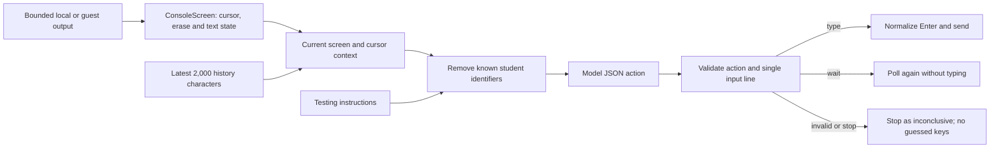

# Console-agent interaction

The September 23 shell conversion uses framework Console/Violations actions and a native sizing
adapter. The same bounded RichTextBox document remains mounted across panel changes; output,
input routing and cancellation contracts below are unchanged. No XAML-generated shell controls remain.

Source reviewed October 5, 2026. Testing instructions and redacted console output/history are sent for the next input choice. Known student identifiers are captured with the test and removed before truncating the model prompt. The validated reply is written to the running program's input stream, never executed as a shell command. Source code remains available for local input validation but is not sent with console-choice prompts. Grading requests retain their separate criteria-and-source-only boundary; free-form prompts are explicitly user-authored.

The agent now decides from a bounded, readable **current screen**, separately from recent action history. This fixes a failure where inventory redraws filled the beginning of the transcript, the current item prompt was omitted, and fallback `q` inputs were sent until the test timed out.

## Data flow

- `ConsoleScreen` keeps 120 columns by 30 rows, matching the runner's ConPTY size. It interprets common cursor movement, clear-screen, erase-line, carriage-return and backspace controls. Colors and terminal-title strings do not reach the model. Escape sequences can span output slices. The parser is a bounded text projection, not a complete terminal emulator; unsupported terminal modes and complex Unicode cell widths are not modeled.
- After a capture gap, the screen is marked potentially incomplete until a clear-screen sequence. The model receives the visible screen plus text near the cursor. Current context overrides old menus and earlier model reasoning.
- Recent history keeps its **tail**. Console output is no longer reduced to its first 800 characters before the agent sees it. The decision prompt also retains the tail if its context limit is reached. Blank screens between redraws are polled again without asking the model to type from old history.
- Replies must contain an explicit JSON action. `type` requires an explicit string input (or `stdin` alias); trailing line endings are removed and embedded control characters/multiple lines are rejected. An explicit empty string can represent Enter. Plain prose, malformed JSON and unsupported actions never become keystrokes.
- `wait` performs another observation without typing. `close` closes redirected stdin and ends interaction. Invalid replies or invalid input receive one correction attempt against the same screen before anything is written. If that also fails, the session stops as **inconclusive**. Explicit `stop` actions and failed model calls stop without retry. There is no fallback `q`, number or other guessed input. Runner termination does not become a student crash deduction.
- `ConsoleInputPolicy` converts an exact displayed menu label such as `1) Buy` into just its key (`1`), and validates options against the nearby menu. Item names remain text when the active prompt is not a menu. For a visible prompt whose C++ source shows `getline(cin, variable)` followed by `stoi(variable)`, it requires one integer rather than a space-separated batch. This is conservative source matching, not general type inference across every supported language.
- Input-reading source stays local for validation. The console-choice prompt contains testing instructions and bounded redacted screen/history context; no source excerpts or file-routing metadata are attached. ConsoleSourceContext remains a tested utility without a production prompt caller.
- A repeated question after a successfully sent answer does not count as a repeated-output failure. This allows loops that collect several scores. Continuous-output, turn and time budgets remain in place.
- ConPTY input uses carriage return for Enter, including when the model originally returned an LF-terminated string. Write failures are surfaced instead of swallowed.
- The 90-second agent budget now cancels pending decisions. Ollama requests receive that cancellation token too. Caller cancellation kills the running session and propagates to the caller.

The automated regressions use synthetic inventory/menu redraws and fake model decisions, plus real redirected/ConPTY processes and runner-protocol tests. They verify the interaction mechanics without sending student code to a model. They do not guarantee that a model chooses the right item or menu option for every assignment.

Rebuild/restart the desktop app for the host-side agent changes. Republish the guest runner for the ConPTY Enter normalization in Hyper-V. An already-running app keeps its loaded code until restarted.

## Ollama structured actions
Console decisions send an explicit JSON schema in Ollama's format field and use temperature 0. The schema requires action, input, reason, and observation; actions are limited to type, wait, close, and stop. Existing parsing, single-line checks, menu/source validation, and the bounded correction retry remain in place: valid JSON does not prove a correct decision. Ordinary feedback requests remain free text. Azure requests retain their existing prompt-based format. Unsupported Ollama schema requests stop inconclusively rather than silently falling back. Request-contract tests use a fake HTTP handler; live model quality must be evaluated separately.

Each model attempt uses the saved Console model wait timeout from AI Provider settings (1–90 seconds, default 30) within the existing 90-second interaction budget. Invalid values in manually edited settings fall back to 30 seconds. Live terminal status reports waiting, returned actions, correction retries, and cleanup. A model timeout cancels the request and stops the student process immediately; the report marks it inconclusive, separately from an overall session timeout. Slow cold starts can reach this limit. A stalled-provider regression verifies cancellation and cleanup even when the provider ignores cancellation.

The console agent also receives a separate history of the last 12 successfully sent inputs so screen redraws cannot erase its action history. Its prompt requests varied relevant paths and a normal displayed exit within the turn budget. This improves planning context but does not guarantee coverage or correct model choices.

Recognized multiline numbered/lettered menus now use a deterministic coverage planner: select each key once per menu, with Leave/Exit/Quit/Back/Return last. The model handles follow-up values. At most 16 menus are tracked. Reports distinguish selected options from untested options; selection is not proof of successful behavior. Unsupported layouts still use the model. Blank-screen observations no longer spend action turns, but remain bounded by the overall deadline.

## Coverage and progress limits
Menu planning uses all visible screen rows through the cursor, rather than the eight-row prompt excerpt. Common choice prompts including Option Choice are recognized. Menu identity includes the nearest nonblank heading above the options; identical headings and options in different contexts remain ambiguous, and menus extending beyond the 30-row screen are not fully observable. The runner allows up to 64 input decisions within 90 seconds; blank observations and model wait actions do not consume that budget. Successful input resets continuous-output detection, while repeated flowing windows without input still trigger the observation guard. Limits can still leave coverage incomplete; selecting an option is not an assertion that it passed.

## Model queue integration (September 16, 2026)

Console-input completions use the shared LLM scheduler with assignment priority and a turn label in the right-side Job queue tab. Requests can wait behind an active completion; priority applies before choosing the next pending request. Cancelling a console request stops that interaction; cancelling its solution-test row propagates through execution and subsequent grading, with cleanup awaited before another solution starts. See [AI job queues](AI_TEST_QUEUE.md).

### Ollama GPU-memory recovery (September 16, 2026)

An explicit CUDA/GPU out-of-memory HTTP server error triggers one CPU retry within the same queued request. Cancellation still applies, and no subsequent job starts during this retry. The same prompt and response schema are preserved. CPU fallback can be slower and consume host RAM; it does not change saved provider settings or impose a RAM budget. Failed jobs retain the server explanation (up to 4,000 characters); unrelated HTTP errors are not retried.

Manual solution actions now distinguish Build and Run from Run (existing output only). Both use the saved Local/VM environment. Local manual launches open the program directly; VM manual runs retain bounded capture and a 90-second limit without manual input forwarding. Test with AI still drives console input. VM Run requires output in the uploaded folder and does not reuse a previous disposable guest.

### Build and run diagnostics (September 20, 2026)

Manual Build, Build and Run, and Run results now open the existing scrollable Console panel instead of placing potentially long logs into a MessageBox. Existing terminal retention limits still apply. Build logs put timeout explanations and recognized xcopy file/directory prompts before raw tool output. A timeout is incomplete evidence, not proof of a student-code defect. Other unexpected UI exceptions still use short error dialogs.

The UI-framework migration retains the native colored RichTextBox terminal and RuntimeTerminalPresenter. Their mailbox, text/run caps and disposal behavior remain unchanged while app-owned settings, review panels and queue controls use declarative hosts.

October 7 recording-driven console-agent review: the captured SDL game displayed WASD/arrows, spacebar and ESC while the model invented a numbered exit and typed literal key names. ConsoleDriverAgent stops for that combined control signature only when the session cannot deliver window events. Local sessions now allow model-selected key/click actions. It sends no GUI screens or guessed physical controls to the model. This guard is based on displayed text. Remote VM sessions remain console-only; visual verification remains unsupported. Prompt instructions explicitly forbid implicitly numbered choices and physical-key names in stdin. ConsoleInputPolicy does not constrain a new item/name question to stale menu numbers above it. Menu coverage and validation recognize simple article-bearing prompts such as Choose an option.

Model-driven local window events (source reviewed October 7, 2026): ConsoleDriverAgent accepts structured key/click decisions in addition to console lines/wait/close/stop. The LLM receives testing instructions and sanitized console history plus transport capability instructions; no source, screen pixels or window titles are supplied. WindowInputAction validates a bounded key vocabulary (letters/digits, arrows, Space/Escape/Enter/Tab; no system chords) and normalized click coordinates. InteractiveProcessSession resolves its launched process ID; WindowInputDispatcher finds a visible unowned window belonging to it, verifies foreground ownership and uses SendInput for key down/up or mouse move/down/up. Focus/delivery errors stop inconclusively. The configurable response timeout and 90-second session limit still apply. Click positions must come from testing instructions; visually dependent outcomes remain unverified. HyperVRunner remains console-only. Runner builds link the shared event types, but remote event transport is not implemented.

October 7 runtime-role correction: the console model system instruction explicitly assigns the runtime operator role, labels assignment prose as reference-only runtime expectations, and forbids switching to grading or requesting source. A stop response claiming missing code/files gets one bounded corrective retry using the same source-free payload; actual focus or interaction limitations still stop. This reduces role confusion but does not guarantee model compliance.

October 7 physical-key parser correction: WindowInputAction accepts equivalent explicit key names (Spacebar/Space, Escape/ESC, Return/Enter and ArrowUp/Up etc.) only for structured key actions; system chords remain rejected. ConsoleDriverAgent reports distinct empty-response, incomplete/malformed JSON and invalid-event errors, with a bounded sanitized model-response sample for failed decisions. The configured local model returned action=key/input=spacebar in a synthetic live controls check, matching the prior parser rejection. No fallback event or additional source payload was introduced.

October 7 window coverage refinement: runtime prompts distinguish initial/unchanged console output from new output and retain full-session movement/selection coverage separately from bounded action history. For advertised game controls, early ESC is rejected with a corrective model retry until assignment-required runtime paths have been accounted for in the model coverage ledger; the final turn still permits cleanup. C# never substitutes keys. This tracks delivered controls, not visually verified outcomes. The model can stop inconclusively when visual evidence is needed.

October 7 assignment-driven coverage: the fixed movement quota is replaced by a model-provided path/status/evidence ledger retained across turns. The operator must enumerate and test all reachable assignment-required paths before exit, retain unfinished paths and separate tested/failed/untested/blocked outcomes. Early game ESC with absent coverage or untested paths receives a corrective retry; blocked outcomes permit cleanup but are explicitly reported inconclusive. Final-turn cleanup remains allowed. The ledger is model-reported, not proof of exhaustive control-flow or visual coverage.
