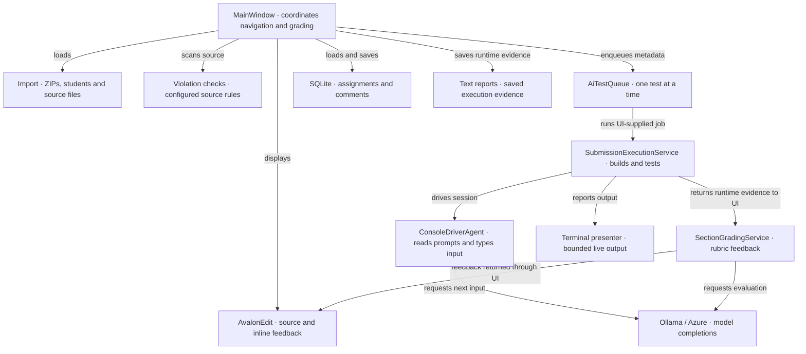
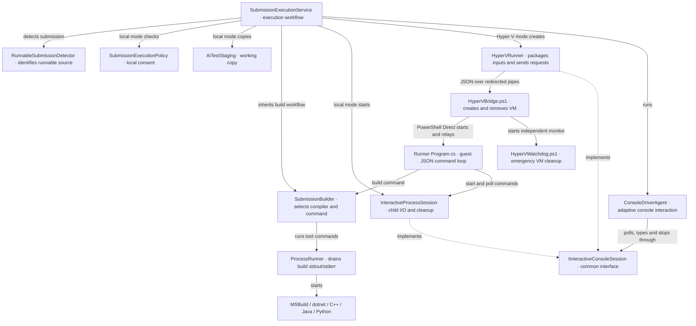
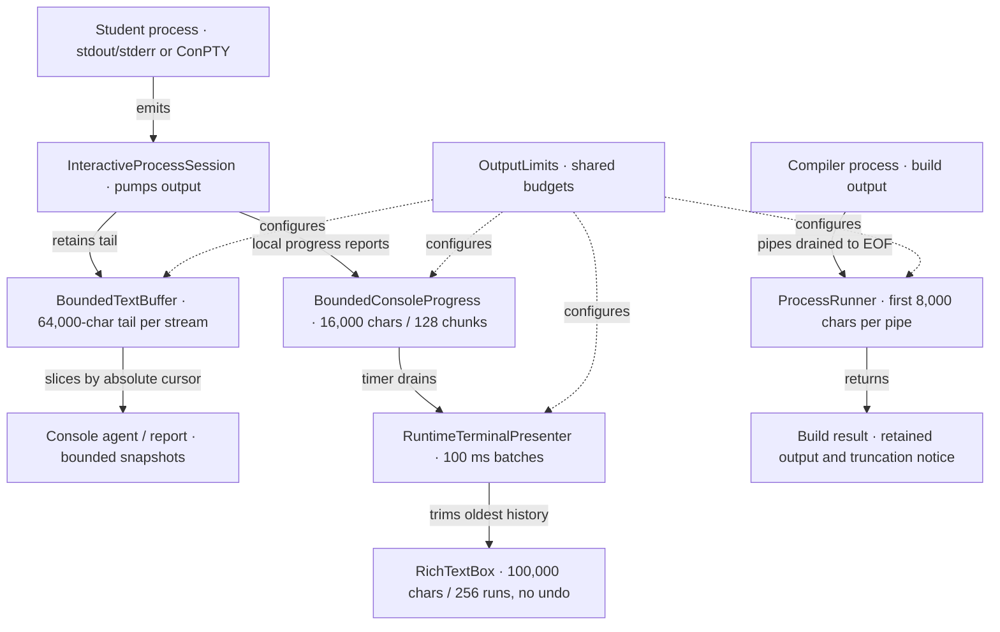
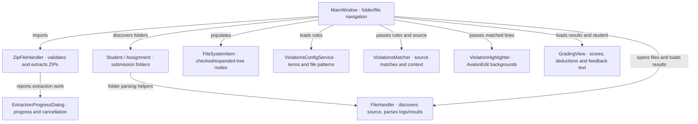
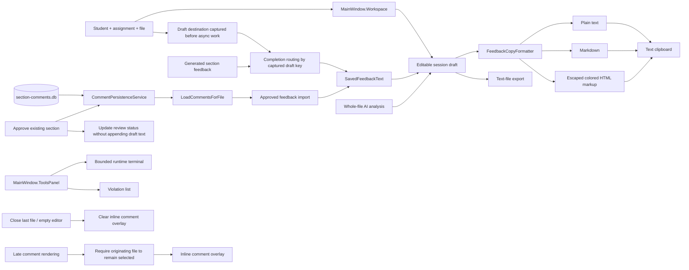
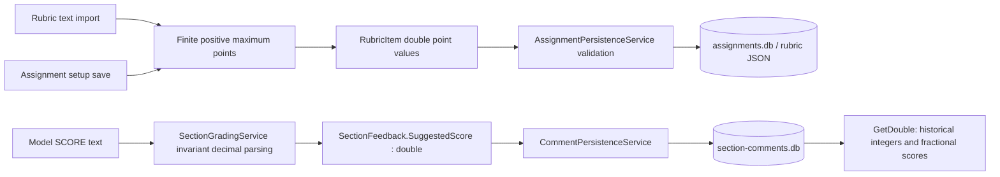

# Lab Feedback dependency knowledge graph

Source-reviewed map of the working tree, updated September 16, 2026. Arrows are labeled with the relationship: calls/uses, data flow, ownership, or implementation. This maps the application components and support tools rather than every method. Grouped nodes expand in the component tables below.

## Application overview

`MainWindow` is the main coordination point. Queue jobs are delegates supplied by it: `AiTestQueue` does not itself reference execution or grading services. Runtime reports reach section grading through that delegate, after execution and disposal complete.

## Execution and isolation

The guest worker compiles shared execution sources directly; it does not load the WPF application. Local tests and Hyper-V tests share the same console capture implementation. The queue awaits service disposal, but emergency watchdog cleanup can outlive a failed bridge; this is not a machine-wide VM lock.

| Component | Responsibility and important dependencies |
| --- | --- |
| `SubmissionExecutionService` | Chooses local/Hyper-V execution, gathers source context, creates runtime reports; also exposes separate Build and Run operations. |
| `SubmissionBuilder` | Chooses language-specific build commands and resolves runnable outputs. Uses `ProcessRunner`, the detector and installed toolchains. |
| `RunnableSubmissionDetector` | Finds solutions, projects, source languages and runnable outputs; filters irrelevant directories. |
| `AiTestStaging` | Copies local test inputs to a staging directory and rewrites original path references. |
| `NativeDependencyStager` | Finds/copies DLL dependencies and supplies extra runtime PATH directories. |
| `PEHeaderReader` | Determines whether a Windows executable uses the console subsystem, guiding ConPTY selection. |
| `InteractiveProcessSession` | Starts child processes, pumps redirected or ConPTY I/O, waits for idle, writes input and disposes native/process resources. |
| `IInteractiveConsoleSession` | Allows the console agent to use the local session and Hyper-V proxy through the same API. |
| `HyperVRunner` | Validates configuration, packages input archives and drives the bridge protocol; exposes guest status/output to the agent. |
| `Lab Feedback Runner/Program.cs` | Handles build/start/poll/input/close/kill JSON commands in the worker process. |
| `ConsoleDriverAgent` | Alternates observing output and asking the model for the next input; tracks findings, bounded turns and runner termination. |
| `ConsoleScreen` | Maintains a bounded readable projection of cursor-positioned terminal output for the agent; separates current screen/cursor context from history. See [console interaction](CONSOLE_INTERACTION.md). |
| `ConsoleInputPolicy` | Converts displayed menu labels to keys and validates single integers when the matching C++ input-read source provides evidence; failed validation requests one model correction. |
| `ConsoleSourceContext` | Selects input-reading source excerpts for the console-agent prompt, including companion headers discovered by the execution service. |
| `NativeExitCodes` | Classifies/describes Windows exit codes for reports. |
| `SubmissionExecutionPolicy` | Requires explicit local consent; isolation failure never grants local execution. |
| `AdversarialInputPlanner` | Prompt/parser and default cases for adversarial inputs. Currently has no production caller in the WPF source; it is not the active console driver. |

## Output and memory ownership

For Hyper-V, the worker sends bounded output through its JSON protocol and `HyperVRunner` forwards it into the host mailbox. `AiTestQueue` bounds concurrent work and waiting-job count separately from these output budgets. See [output memory limits](MEMORY_LIMITS.md) for exact policies, tests, deployment notes and remaining risks.

## Grading, models and persistence

```mermaid
flowchart TD
    UI["MainWindow · assembles context and handles review"]
    Context["RelatedFileResolver · headers and companion source"]
    Grade["SectionGradingService · rubric prompt and parsed feedback"]
    Sanitize["StudentDataSanitizer · removes identifiers"]
    Agent["ConsoleDriverAgent · next-input prompt"]
    Route["LlmCompletionService · provider selection"]
    Ollama["OllamaService · local model HTTP calls"]
    Azure["AzureOpenAIService · Azure HTTP calls"]
    Feedback["SectionFeedback · issues, suggestions and review state"]
    Overlay["InlineCommentLayer + Adorner · review controls"]
    Comments["CommentPersistenceService · SQLite comments"]
    Assignment["AssignmentPersistenceService · SQLite rubric library"]
    Settings["LLMSettings · provider, execution and model settings"]
    UI -->|resolves dependencies| Context
    UI -->|source, rubric and runtime report| Grade
    Grade -->|sanitizes prompt context| Sanitize
    Grade -->|selected provider| Ollama
    Grade -->|selected provider| Azure
    Screen["ConsoleScreen · readable current terminal state"]
    Agent -->|feeds received terminal updates| Screen
    Screen -->|screen and cursor context| Agent
    InputPolicy["ConsoleInputPolicy · menu keys and input validation"]
    SourceContext["ConsoleSourceContext · input-reading excerpts"]
    Agent -->|checks before typing| InputPolicy
    Agent -->|builds prompt context| SourceContext
    Agent -->|requests validated JSON action| Route
    Route -->|selected provider| Ollama
    Route -->|selected provider| Azure
    Settings -.->|configures| Grade
    Settings -.->|configures| Route
    Grade -->|returns| Feedback
    UI -->|renders feedback| Overlay
    Overlay -->|approve, reject, regenerate events| UI
    UI -->|loads and saves feedback| Comments
    UI -->|loads and saves assignment definitions| Assignment
```

| Component | Responsibility |
| --- | --- |
| `RelatedFileResolver` | Finds paired files/includes and extracts declared types so related definitions can be included in grading. |
| `SectionGradingService` | Sanitizes source, builds a rubric-based prompt, calls the selected provider and parses `SectionFeedback`. |
| `StudentDataSanitizer` | Redacts student identifiers, emails and personal paths; supplies anonymous display names. |
| `LlmCompletionService` | Routes console-agent completion requests using `LLMSettings`. Section grading calls provider services directly. |
| `OllamaService` / `AzureOpenAIService` | HTTP adapters for model analysis/completion. Model memory is outside the WPF output budgets. |
| `CommentPersistenceService` | Stores feedback keyed to files/sections, including review state, in `section-comments.db`. |
| `AssignmentPersistenceService` | Stores course/assignment requirements and rubric definitions in SQLite. |
| `InlineCommentLayer` | Positions feedback alongside AvalonEdit lines and relays review events. |
| `InlineCommentAdorner` | Displays the feedback card and its approve/regenerate/reject actions. |

## Import, navigation and grading interface

| UI or model | What it represents / does |
| --- | --- |
| `App` / `App.xaml` | Starts the WPF app and configures theme/backdrop integration. |
| `MainWindow` | Owns the editor, navigation, queue, grading commands, comment cache and runtime terminal. |
| `SettingsWindow` | Edits violation terms and scanned file patterns. |
| `LLMSettingsWindow` | Edits/test-connects model providers and configures execution mode, worker folder and VM inputs. |
| `AssignmentSetupWindow` | Edits/saves course requirements and rubric items. |
| `SectionGradingDialog` | Selects rubric items for a section. |
| `ExtractionProgressDialog` | Tracks extraction operations and cancellation. Source filename is `ExtractionProgressDialogue.xaml.cs`. |
| `GradingView` | Displays test scores, deductions and remarks; produces feedback HTML. Source filename is `GradeView.xaml.cs`. |
| `Student` | Student identity and folder, with folder discovery/parsing. |
| `Assignment` | Submission assignment folder discovery and consolidation. Distinct from the rubric definition below. |
| `GradingAssignment` / `RubricItem` | Course, requirements, rubric criteria, points and grading totals. |
| `SectionFeedback` / `FeedbackReviewStatus` | Per-section findings, suggested code/score and pending/approved/rejected state. |
| `FileSystemItem` | File/folder tree state, selection flags and child nodes. |
| `LabResults` / `TestResult` | Imported test-result data from `AssignmentResults.cs`. |
| `Result` | Parsed legacy log summary item. |
| `Deduction` | Score reduction or automatic-zero choice. |
| `Violation` | A matched rule with line/context information. |
| `LLMSettings` / `LLMProvider` / `SubmissionExecutionMode` | JSON-backed model and execution preferences. |
| `InverseBoolToVisibilityConverter` | Converts view state to WPF visibility. |

## Projects, libraries and support tools

| Boundary | Connected components and purpose |
| --- | --- |
| `Lab Feedback WPF.csproj` | Windows .NET 10 app. Uses WPF-UI for chrome, AvalonEdit for code, Microsoft.Data.Sqlite/SQLitePCLRaw for persistence. |
| `Lab Feedback Runner.csproj` | Separate worker executable. Compiles shared builder, detector, process/session, dependency, PE-header and bounded-output sources. |
| `Lab Feedback WPF.Tests.csproj` | MSTest service, queue, output, WPF presenter and worker integration tests. |
| `HyperVBridge.ps1` | VM lifecycle, archive transfer and JSON request relay to guest worker. |
| `HyperVWatchdog.ps1` | Stops the exact owned VM if its bridge disappears or its lifetime expires. |
| `Inspect-RunnerHost.ps1` | Host diagnostics including virtualization and available memory. |
| `Setup-RunnerTemplate.ps1`, `Invoke-RunnerTemplateSetup.ps1`, `Install-RunnerGuestTools.ps1` | Prepare the reusable Windows guest/template and its development tools. |
| `New-RunnerAnswerMedia.ps1`, `Download-RunnerIso.py` | Setup support for unattended answer media and installation media. |
| `Resources/*.xshd` | AvalonEdit syntax/theme definitions. |
| `AI_TEST_QUEUE.md`, `MEMORY_LIMITS.md`, `EXECUTION_SAFETY.md` | Queue behavior, output budgets and runner deployment/consent documentation. |

This graph is a documentation snapshot. Update it when a service is added, a call path changes, or memory ownership moves. Remaining memory work is concentrated in `MainWindow`'s feedback cache/eager tree and whole-file reads in `FileHandler`/source-context construction.

### Menu coverage planner
ConsoleDriverAgent uses ConsoleScreen.MenuContext to supply visible rows through the cursor to ConsoleMenuCoverage. ConsoleMenuCoverage tracks selections per heading and option list, schedules exit choices last, and returns coverage summaries to the agent report. ConsoleInputPolicy validates the chosen key before InteractiveProcessSession sends it. The model handles prompts that the planner does not recognize.

## Review workspace and feedback flow

Draft edits stay in memory; the arrow from SQLite imports original section records and does not save edited drafts back. Import tracking avoids repeated appends within a session. Tool-tab collapse frees the bottom content row without clearing capture buffers. See [feedback workspace documentation](FEEDBACK_WORKSPACE.md) for limitations and review findings.

## Decimal scores and rubric validation

New section-score columns use REAL affinity. Existing SQLite INTEGER-affinity columns can retain fractional values; no destructive table migration is required. Setup and persistence validation reject nonfinite or nonpositive rubric maxima. DecimalFeedbackTests cover decimal parsing under a non-English culture and compatibility with an existing INTEGER-affinity column.

### Current behavioral boundaries
- Batch and queued grading capture the destination draft before awaiting work. Results for another selection remain in that draft rather than opening the currently selected student's panel.
- Approval persists status without republishing feedback. Generated sections and restored approved sections share import tracking and SavedFeedbackText.
- Empty-editor transitions clear inline overlays. RenderCommentsForFile ignores late results for a file that is no longer selected.
- Draft edits remain session-only; section persistence is still file-keyed rather than assignment-keyed. See FEEDBACK_WORKSPACE.md for remaining limitations.

### Maintenance
Update affected diagrams and component descriptions in the same change as dependency, workflow, persistence, or memory-ownership changes. Document implemented behavior separately from planned work. The date above records the latest source-checked update, not an automated synchronization guarantee.
