# GuidedGrade dependency knowledge graph

Latest affected-path source review: October 9, 2026 (persistent student grades, active assignment/lab badges and current-course running totals; configurable console model wait and local/grading confirmations; queued-review student/lab/assignment isolation; criteria-and-source-only grading payloads; console-choice prompts and user-authored free-form tasks; PR #2 review: both legacy data roots, diagnostics conflict preservation and runner credential default; GuidedGrade product, project, assembly and namespace rename; automatic roaming/local product-data migration; process exit-code propagation; shared provider HTTP ownership; runner credential defaults and benchmark provenance; packaged application-owned COM cleanup, failure reporting and ordered shutdown; file-tree virtualization and active-file selection retention retained). Reviewed C# startup, shell composition, native control ownership, declarative file tabs/pickers/navigation/status, code-built native styles, panel state, persistence paths and disposal. All application-owned XAML has been removed. Nullable contracts and student folder validation were also reviewed; default discovery skips malformed entries; per-course folder-name mode lists all immediate folders, and missing Ollama content retains the existing no-response fallback.

Source-reviewed map of the working tree, updated October 7, 2026 (compact workspace toolbar, focused panel views/view models and native File/Settings menus; UI-framework hosts/state/lifecycle, native dark styles, review toolbar and collapsed review cards, retained native islands and extraction cancellation, file Clear review persistence/cache invalidation, native post-build paths and Console diagnostics, explicit overall/section feedback menus, overall rubric prompts, saved execution preferences and run-only worker path reviewed; job scheduling, provider cancellation, GPU-memory fallback, pinned workspace tabs, visibility persistence and section detection reviewed). Arrows are labeled with the relationship: calls/uses, data flow, ownership, or implementation. This maps the application components and support tools rather than every method. Grouped nodes expand in the component tables below.

## Maintenance services and validation (October 9, 2026)

Manual and batch overall review preparation now resides in `ReviewOrchestrator`, with anonymous selected-file packets and rejection of missing/oversized input. `LlmCompletionService` routes both overall and section requests to Ollama or Azure; direct OpenAI remains unimplemented, is hidden in settings, and cannot fall through to Ollama. `ProtectedSettingsStore` migrates plaintext API keys and writes current-user DPAPI ciphertext atomically. `BoundedTextReader` enforces byte limits without source truncation. `CodeSectionDetector` handles multiline method signatures with a regex timeout and comment/string brace handling; it remains a heuristic, not a C++ parser. `SubmissionFolderLoader` owns bounded folder-tree traversal and immediate student-folder discovery, exposing skipped-folder warnings to the shell. MainWindow still owns UI workflows and review publication/persistence coordination; this extraction does not remove all shell responsibilities.

`ReviewDraftStore` saves instructor-edited drafts in the assignments database and retains 64 cached contexts. File comments retain 128 cache entries with the active file pinned; review generation tokens retain 4,096 entries, and eviction makes captured work stale. Persisted records are not deleted by cache eviction. Import deduplication markers remain session-local. Windows CI builds the runner and runs tests except `FrameworkMigrationTests`, which require an interactive desktop. Existing Linux graph validation remains separate. Workflow execution in GitHub Actions is not yet verified locally.

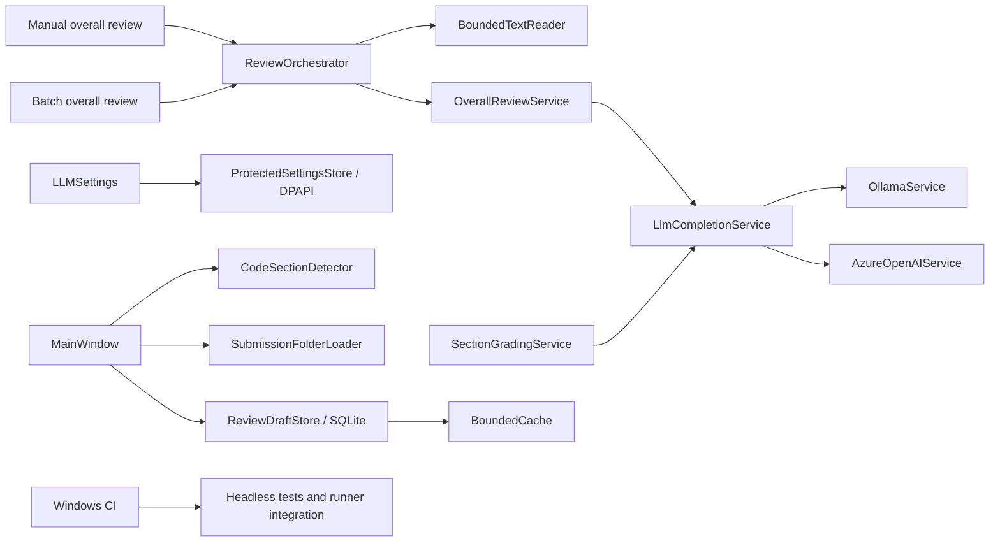

## Application overview

October 6, 2026 graph-tooling source review: [offline searchable file/project map](docs/knowledge-graph/graph.html)
and [canonical JSON](docs/knowledge-graph/graph.json) supplement this manually reviewed runtime map.
`scripts/update-knowledge-graph.py` extracts supported file nodes, directory membership,
relative documentation links and declared XML project/package references. It does not infer C# call paths.
The staged-input pre-commit hook updates only generated outputs; GitHub Actions validates freshness.
First-time setup stages the extractor and renderer together. If the renderer is absent
from the index, generation stops before writing outputs and explains staging or
`--worktree` preview options (source reviewed October 6, 2026).
Worktree previews include non-ignored new source files without staging existing application changes.
October 6 viewer source review: the HTML embeds pinned MIT Three.js 0.160.1
and its license from scripts/knowledge-graph-vendor, excluded from graph nodes.
It supports pan/zoom/fit, filters, selected-edge highlighting, relationship navigation
and neighborhood filtering. A native node selector/inspector works without WebGL.
The renderer and vendor assets use the same index/worktree input mode as extraction.

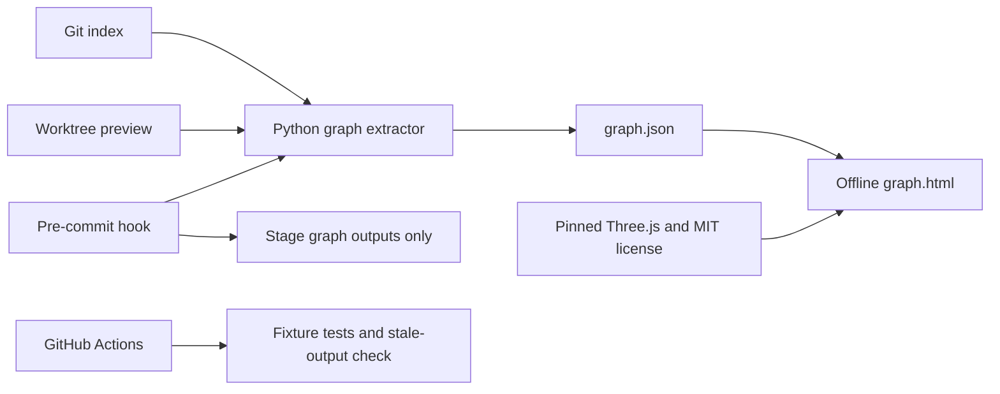

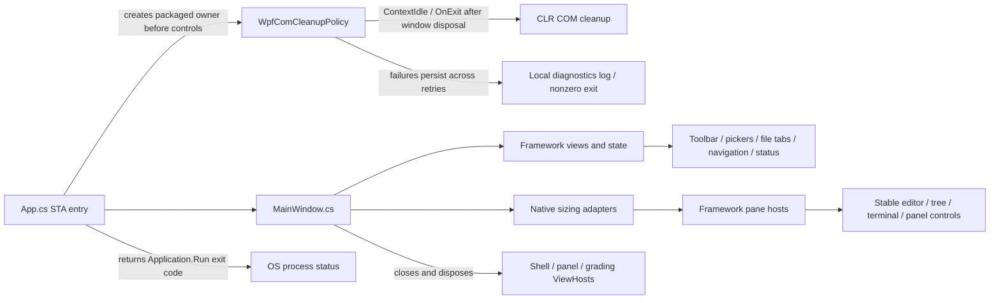

```mermaid
flowchart TD
    UI["MainWindow · coordinates navigation and grading"]
    Import["Import · ZIPs, students and source files"]
    Editor["AvalonEdit · source and inline feedback"]
    Rules["Violation checks · configured source rules"]
    Queue["AiTestQueue · one solution test at a time"]
    Jobs["LlmJobQueue.Shared · assignments before general requests"]
    JobPanel["Right-side Job queue tab · counts, status, cancellation and free-form tasks"]
    Execute["SubmissionExecutionService · builds and tests"]
    Agent["ConsoleDriverAgent · reads prompts and types input"]
    Grade["SectionGradingService · rubric feedback"]
    Model["Ollama / Azure · model completions"]
    Store["SQLite · assignments, student grades and comments"]
    GradeRecords["GradePersistenceService · captured review scope"]
    Totals["GradeTotals · earned / possible for current course"]
    GradeUI["MainWindow.Grades · row badges, footer and grade editor"]
    UI --> GradeUI
    GradeUI -->|instructor saves or clears| GradeRecords
    GradeRecords -->|StudentGrades in assignments.db| Store
    GradeUI -->|cached records| Totals
    Totals -->|points and percentage| GradeUI
    Terminal["Terminal presenter · bounded live output"]
    Reports["Text reports · saved execution evidence"]
    Panels["Stable Comments / Job queue / Rubric tab host"]
    Preferences["WorkspacePanelPreferences · per-user JSON visibility"]
    UI -->|selects content without replacing host| Panels
    Panels -->|retains queue controls| JobPanel
    UI -->|loads and applies Settings choices| Preferences
    UI -->|loads| Import
    UI -->|displays| Editor
    Editor -->|Approve persists status and imports once| ApprovedDraft["Matching Comments draft and live editor binding"]
    UI -->|scans source| Rules
    UI -->|enqueues metadata| Queue
    UI --> BatchDesign["MainWindow.BatchReview · file-list designer and preview"]
    BatchDesign --> BatchPlan["BatchReviewPlan · per-student paths and sequential loop"]
    BatchPlan -->|optional leading **/; newest modified match within student folder| NestedPaths["Recursive suffix resolution · skip links; newest timestamp wins"]
    BatchDesign -->|one captured batch delegate| Queue
    BatchPlan -->|optional build/run once per student| Execute
    BatchPlan -->|clear selected file reviews, invalidate old responses| BatchClear["ClearBatchFileReview and ReviewDraftCleanup"]
    BatchPlan -->|one combined overall request per student| BatchOverall["OverallFeedbackPrompt and CompleteOverallFileReview"]
    Queue -->|runs UI-supplied job| Execute
    Execute -->|drives session| Agent
    Agent -->|redacted console and testing instructions| Jobs
    JobPanel -->|user-authored free-form request| Jobs
    UI -->|shows snapshots and cancels jobs| JobPanel
    Jobs -->|one provider request at a time| Model
    Execute -->|reports output| Terminal
    UI -->|after execution: captured criteria and source only| Grade
    Grade -->|assignment request| Jobs
    Grade -->|feedback returned through UI| Editor
    UI -->|loads and saves| Store
    Store -->|reviewed-file locations ordered by saved time| SavedNavigation["Student selection / Comments links / queue open-review action"]
    SavedNavigation -->|exact student and assignment context| Editor
    UI -->|saves runtime evidence| Reports
```

`LlmJobQueue.Shared` serializes provider requests process-wide; assignments precede waiting general jobs without interrupting active requests. The right-side queue tab shows solution jobs and model requests separately; its status indicator counts both levels separately. `AiTestQueue` wraps another scheduler instance to preserve whole-test execution/disposal ordering and solution-path deduplication. Cancelling a solution propagates to execution and runtime grading. Cancelling an individual model request does not cancel unrelated requests or the entire grading batch.

`MainWindow` is the main coordination point. Queue jobs are delegates supplied by it: `AiTestQueue` does not itself reference execution or grading services. Runtime reports remain local. After execution and disposal, the delegate grades captured files using criteria and source only.

## Execution and isolation


The guest worker compiles shared execution sources directly; it does not load the WPF application. Local tests and Hyper-V tests share the same console capture implementation. The queue awaits service disposal, but emergency watchdog cleanup can outlive a failed bridge; this is not a machine-wide VM lock.

| Component | Responsibility and important dependencies |
| --- | --- |
| `SubmissionExecutionService` | Chooses local/Hyper-V execution, gathers source context, creates runtime reports; also exposes Build, Build and Run, and Run without compilation. Manual local actions use the original submission directory, so a later Run finds built output. |
| `SubmissionBuilder` | Chooses language-specific build commands and resolves runnable outputs. Uses `ProcessRunner`, the detector and installed toolchains. |
| `RunnableSubmissionDetector` | Finds solutions, projects, source languages and runnable outputs; filters irrelevant directories. |
| `AiTestStaging` | Copies local test inputs to a staging directory and rewrites original path references. |
| `NativeDependencyStager` | Finds/copies DLL dependencies and supplies extra runtime PATH directories. |
| `PEHeaderReader` | Determines whether a Windows executable uses the console subsystem, guiding ConPTY selection. |
| `InteractiveProcessSession` | Starts child processes, pumps redirected or ConPTY I/O, waits for idle, writes input and disposes native/process resources. |
| `IInteractiveConsoleSession` | Allows the console agent to use the local session and Hyper-V proxy through the same API. |
| `HyperVRunner` | Validates configuration, packages input archives and drives the bridge protocol; exposes guest status/output to the agent. |
| `GuidedGrade.Runner/Program.cs` | Handles build/start/poll/input/close/kill JSON commands in the worker process. |
| `ConsoleDriverAgent` | Uses local menu planning or a model choice from redacted console output and testing instructions, validates the result, and sends one input line to the running program. |
| `ConsoleScreen` | Maintains a bounded readable projection of cursor-positioned terminal output for the agent; separates current screen/cursor context from history. See [console interaction](CONSOLE_INTERACTION.md). |
| `ConsoleInputPolicy` | Converts displayed menu labels to keys and validates single integers when the matching C++ input-read source provides evidence; failed validation allows one model correction before stopping inconclusively. |
| `ConsoleSourceContext` | Retained source-excerpt utility with test coverage; console model requests use output and testing instructions instead of source excerpts. |
| `NativeExitCodes` | Classifies/describes Windows exit codes for reports. |
| `SubmissionExecutionPolicy` | Accepts the saved Local preference with ConfirmLocalExecution disabled, or asks for per-operation consent; the explicit local-test menu preserves that preference. Isolation failure never grants local execution. |
| `AdversarialInputPlanner` | Prompt/parser and default cases for adversarial inputs. Currently has no production caller in the WPF source; it is not the active console driver. |

## Output and memory ownership

```mermaid
flowchart TD
    Child["Student process · stdout/stderr or ConPTY"]
    Capture["InteractiveProcessSession · pumps output"]
    Ring["BoundedTextBuffer · 64,000-char tail per stream"]
    Agent["Console agent / report · bounded snapshots"]
    Mail["BoundedConsoleProgress · 16,000 chars / 128 chunks"]
    Render["RuntimeTerminalPresenter · 100 ms batches"]
    Doc["RichTextBox · 100,000 chars / 256 runs, no undo"]
    Compiler["Compiler process · build output"]
    Build["ProcessRunner · first 8,000 chars per pipe"]
    BuildReport["Build result · retained output and truncation notice"]
    Limits["OutputLimits · shared budgets"]
    Child -->|emits| Capture
    Capture -->|retains tail| Ring
    Ring -->|slices by absolute cursor| Agent
    Capture -->|local progress reports| Mail
    Mail -->|timer drains| Render
    Render -->|trims oldest history| Doc
    Compiler -->|pipes drained to EOF| Build
    Build -->|returns| BuildReport
    Limits -.->|configures| Ring
    Limits -.->|configures| Mail
    Limits -.->|configures| Render
    Limits -.->|configures| Build
```

For Hyper-V, the worker sends bounded output through its JSON protocol and `HyperVRunner` forwards it into the host mailbox. `AiTestQueue` bounds concurrent work and waiting-job count separately from these output budgets. See [output memory limits](MEMORY_LIMITS.md) for exact policies, tests, deployment notes and remaining risks.

## Grading, models and persistence

```mermaid
flowchart TD
    UI["MainWindow · assembles context and handles review"]
    Context["RelatedFileResolver · headers and companion source"]
    Grade["SectionGradingService · rubric prompt and parsed feedback"]
    Sanitize["StudentDataSanitizer · removes identifiers"]
    Agent["ConsoleDriverAgent · validated next input"]
    Jobs["LlmJobQueue.Shared · priority and cancellation"]
    Ollama["OllamaService · local model HTTP calls"]
    Azure["AzureOpenAIService · Azure HTTP calls"]
    Feedback["SectionFeedback · issues, suggestions and review state"]
    Overlay["InlineCommentLayer + Adorner · review controls"]
    Comments["CommentPersistenceService · SQLite comments"]
    Assignment["AssignmentPersistenceService · SQLite rubric library"]
    Settings["LLMSettings · provider, execution and model settings"]
    UI -->|resolves dependencies| Context
    UI -->|explicit section action: source and rubric only| Grade
    UI -->|explicit overall action: captured assignment and checked source files| Overall[OverallFeedbackPrompt]
    Overall -->|combined rubric review prompt| Ollama
    Overall -->|combined rubric review prompt| Azure
    Grade -->|sanitizes prompt context| Sanitize
    Errors["LlmHttpErrors · bounded server error details"]
    Ollama -->|GPU out-of-memory: one CPU retry in same job| Ollama
    Ollama -->|formats failed HTTP responses| Errors
    Azure -->|formats failed HTTP responses| Errors
    Ollama -->|enqueues HTTP delegate| Jobs
    Azure -->|enqueues HTTP delegate| Jobs
    Grade -->|selected provider| Ollama
    Grade -->|selected provider| Azure
    Screen["ConsoleScreen · readable current terminal state"]
    Agent -->|feeds received terminal updates| Screen
    Screen -->|screen and cursor context| Agent
    InputPolicy["ConsoleInputPolicy · menu keys and input validation"]
    Agent -->|checks before typing| InputPolicy
    Agent -->|redacted screen and testing instructions| Route[LlmCompletionService]
    UI -->|explicit user-authored free-form prompt| Route
    Route -->|selected provider| Ollama
    Route -->|selected provider| Azure
    Azure -->|request-local API key and URL| AzureHttp[Process-owned Azure HttpClient]
    Ollama -->|request-local URL and model| OllamaHttp[Process-owned Ollama HttpClient]
    Settings -.->|configures| Grade
    Settings -->|saved ConfirmGrading| Confirm[GradingConfirmation]
    UI -->|one confirmation per requested batch| Confirm
    Confirm -->|approved or prompting disabled| Grade
    Settings -->|ConsoleModelWaitSeconds within overall deadline| Agent
    Grade -->|returns| Feedback
    UI -->|renders feedback| Overlay
    UI -->|Clear review deletes file records| Comments
    UI -->|Clear review invalidates pending section publication| Generation[ReviewGeneration]
    UI -->|Clear review removes visible comments| Overlay
    Overlay -->|approve, reject, regenerate events| UI
    UI -->|loads and saves feedback| Comments
    UI -->|loads and saves assignment definitions| Assignment
    DataPaths["AppDataPaths · GuidedGrade roaming/local roots"] --> Comments
    DataPaths --> Assignment
    Legacy["LabFeedbackWPF and Lab Feedback WPF legacy directories"] -->|move missing data on access| DataPaths
```

| Component | Responsibility |
| --- | --- |
| `RelatedFileResolver` | Finds paired files/includes and extracts declared types so related definitions can be included in grading. |
| `OverallFeedbackPrompt` | Captures assignment requirements and rubric instructions for one combined review of checked files; requests criterion scores and one total, or qualitative feedback when no rubric exists. Includes sanitized source supplied by MainWindow. |
| `SectionGradingService` | Sanitizes source, builds a rubric-based prompt, calls the selected provider and parses `SectionFeedback`. |
| `StudentDataSanitizer` | Redacts student identifiers, emails and personal paths; supplies anonymous display names. |
| `LlmCompletionService` | Routes console-choice and user-authored free-form requests; section grading calls provider services directly. |
| `OllamaService` / `AzureOpenAIService` | HTTP adapters with one process-lifetime client per provider, reused across grading, console choices, user tasks and settings checks. Pooled connections have a five-minute lifetime; cookies are disabled. Azure API keys are request-local. Injected test clients remain caller-owned. Model memory is outside the WPF output budgets. |
| `AppDataPaths` | Owns `%APPDATA%/GuidedGrade` and `%LOCALAPPDATA%/GuidedGrade`; migrates both legacy product directories on access and preserves conflicting files in their original locations. |
| `CommentPersistenceService` | Stores feedback keyed to file, ReviewContext, section and line range, including review state, in `section-comments.db`. |
| `AssignmentPersistenceService` | Stores course/assignment requirements and rubric definitions in SQLite. |
| `InlineCommentLayer` | Positions feedback alongside AvalonEdit lines and relays review events. |
| `InlineCommentAdorner` | Owns a disposable framework ViewHost with expanded/approved state, bounded scrollable details and approve/regenerate/reject events. |

## Import, navigation and grading interface

```mermaid
flowchart TD
    UI["MainWindow · folder/file navigation"]
    Zip["ZipFileHandler · validates and extracts ZIPs"]
    Progress["ExtractionProgressDialog · progress and cancellation"]
    Student["Student / Assignment · submission folders"]
    File["FileHandler · discovers source, parses logs/results"]
    Tree["FileSystemItem · checked/expanded tree nodes"]
    Config["ViolationsConfigService · terms and file patterns"]
    Match["ViolationsMatcher · source matches and context"]
    Highlight["ViolationHighlighter · AvalonEdit backgrounds"]
    GradeView["GradingView · scores, deductions and feedback text"]
    UI -->|owns and disposes declarative panels| Host[ViewHost from SignalNotNoise.UI.Wpf]
    Forms[ReviewWindow settings and grading forms] -->|owns and disposes| Host
    Theme[ReviewTheme] -->|tokens and inherited colors| Host
    State[State and StateList] -->|reactive descriptions| Host
    Host -->|native WPF renderer| Native[Windows controls]
    UI -->|retains specialized native controls| Native
    Zip -->|reports extraction work| Progress
    UI -->|discovers folders| Student
    Student -->|folder parsing helpers| File
    UI -->|opens files and loads results| File
    UI -->|populates| Tree
    UI -->|loads rules| Config
    UI -->|passes rules and source| Match
    UI -->|passes matched lines| Highlight
    UI -->|loads results and student| GradeView
```

| UI or model | What it represents / does |
| --- | --- |
| `App.cs` | Explicit STA entry point creates Application/MainWindow and uses OnMainWindowClose shutdown. ReviewTheme supplies the app palette; no generated startup or XAML load remains. |
| `MainWindow` | Owns the editor, navigation, solution queue, grading commands, comment cache and runtime terminal. `MainWindow.JobQueue.cs` refreshes the independent right-side queue tab and count indicator, routes cancellation and submits user-authored free-form tasks. |
| `LlmJobQueue` | Thread-safe assignment/general priority scheduler, used process-wide by providers and separately by the solution wrapper. Bounded active/pending count and completed snapshots; cancellation tokens reach HTTP calls. |
| `SettingsWindow` | Edits violation terms and scanned file patterns. |
| `LLMSettingsWindow` | Edits/test-connects model providers and configures execution mode, worker folder and VM inputs. |
| `AssignmentSetupWindow` | Coordinates dedicated setup views/view models, saved selection and previewed local prompt imports. |
| `SectionGradingDialog` | Selects rubric items for a section. |
| `ExtractionProgressDialog` | Framework operation cards with native progress bars; cancellation on close; worker-owned token sources. Sources: `Views/ExtractionProgressDialog.cs`, `Views/ExtractionOperation.cs`. |
| `GradingView` | Declarative score, deduction and remarks view in `Views/GradingView.cs`; native HTML editors and sliders retain specialized editing behavior. Produces feedback HTML. |
| `Student` | Student identity and folder, with folder discovery/parsing. Defaults to Last_First-ID parsing, skipping invalid folders. Per-course folder-name mode instead lists every immediate directory by its literal name with no fabricated ID. |
| `Assignment` | Submission assignment folder discovery and consolidation. Distinct from the rubric definition below. |
| `GradingAssignment` / `RubricItem` | Course, requirements, rubric criteria, points and grading totals. |
| `SectionFeedback` / `FeedbackReviewStatus` | Per-section findings, suggested code/score and pending/approved/rejected state. |
| `FileSystemItem` | File/folder tree state, selection flags and child nodes. |
| `LabResults` / `TestResult` | Imported test-result data from `AssignmentResults.cs`. |
| `Result` | Parsed legacy log summary item. |
| `Deduction` | Score reduction or automatic-zero choice. |
| `Violation` | A matched rule with line/context information. |
| `LLMSettings` / `LLMProvider` / `SubmissionExecutionMode` | JSON-backed model and execution preferences. |
| `InverseBoolToVisibilityConverter` | Converts view state to WPF visibility. |

## Projects, libraries and support tools

| Boundary | Connected components and purpose |
| --- | --- |
| `GuidedGrade.csproj` | Windows .NET 10 app. Uses pinned SignalNotNoise.UI.Wpf local packages for declarative surfaces, native WPF islands/AvalonEdit for specialized controls, Microsoft.Data.Sqlite/SQLitePCLRaw for persistence. |
| `GuidedGrade.Runner.csproj` | Separate worker executable. Compiles shared builder, detector, process/session, dependency, PE-header and bounded-output sources. |
| `GuidedGrade.Tests.csproj` | MSTest service, queue, output, WPF presenter and worker integration tests. |
| `HyperVBridge.ps1` | VM lifecycle, archive transfer and JSON request relay to guest worker. |
| `HyperVWatchdog.ps1` | Stops the exact owned VM if its bridge disappears or its lifetime expires. |
| `Inspect-RunnerHost.ps1` | Host diagnostics including virtualization and available memory. |
| `Setup-RunnerTemplate.ps1`, `Invoke-RunnerTemplateSetup.ps1`, `Install-RunnerGuestTools.ps1` | Prepare the reusable Windows guest/template and its development tools. |
| `New-RunnerAnswerMedia.ps1`, `Download-RunnerIso.py` | Setup support for unattended answer media and installation media. |
| `Resources/*.xshd` | AvalonEdit syntax/theme definitions. |
| `AI_TEST_QUEUE.md`, `MEMORY_LIMITS.md`, `EXECUTION_SAFETY.md` | Queue behavior, output budgets and runner deployment/consent documentation. |

This graph is a documentation snapshot. Update it when a service is added, a call path changes, or memory ownership moves. Remaining memory work is concentrated in `MainWindow`'s feedback cache/eager tree and whole-file reads in `FileHandler`/source-context construction.

### Menu coverage planner
ConsoleDriverAgent uses ConsoleScreen.MenuContext to supply visible rows through the cursor to ConsoleMenuCoverage. ConsoleMenuCoverage tracks selections per heading and option list, schedules exit choices last, and returns coverage summaries to the agent report. ConsoleInputPolicy validates the chosen key before InteractiveProcessSession sends it. Unrecognized prompts are sent to the model as redacted console context with testing instructions. Validated model input is sent to the running program; invalid replies, timeout or uncertainty stop inconclusively.


## Review workspace and feedback flow

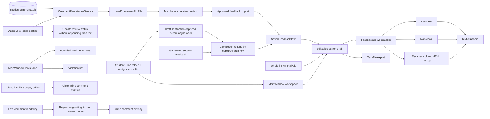

Draft edits stay in memory; the arrow from SQLite imports original section records and does not save edited drafts back. Import tracking avoids repeated appends within a session. Tool-tab collapse frees the bottom content row without clearing capture buffers. See [feedback workspace documentation](FEEDBACK_WORKSPACE.md) for limitations and review findings.

## Decimal scores and rubric validation

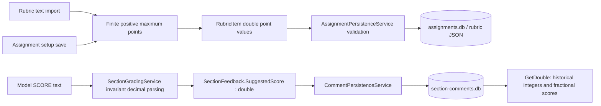

New section-score columns use REAL affinity. Existing SQLite INTEGER-affinity columns can retain fractional values; no destructive table migration is required. Setup and persistence validation reject nonfinite or nonpositive rubric maxima. DecimalFeedbackTests cover decimal parsing under a non-English culture and compatibility with an existing INTEGER-affinity column.

### Current behavioral boundaries
- Batch and queued grading capture the destination draft before awaiting work. Results for another selection remain in that draft rather than opening the currently selected student's panel.
- Approval persists status without republishing feedback. Generated sections and restored approved sections share import tracking and SavedFeedbackText.
- Empty-editor transitions clear inline overlays. RenderCommentsForFile ignores late results for a file that is no longer selected.
- Draft edits remain session-only; section persistence includes the originating student/lab/assignment context alongside the file and section. See FEEDBACK_WORKSPACE.md for remaining limitations.

### Maintenance
Update affected diagrams and component descriptions in the same change as dependency, workflow, persistence, or memory-ownership changes. Document implemented behavior separately from planned work. The date above records the latest source-checked update, not an automated synchronization guarantee.

### Provider failure handling (source reviewed September 16, 2026)

Ollama reads HTTP error bodies before throwing. A server error explicitly mentioning CUDA/GPU and out-of-memory triggers one retry of the same prompt with `num_gpu: 0`, within the current queue job. Structured-response schema and temperature are preserved; cancellation prevents further attempts. Other HTTP failures are not retried. `LlmHttpErrors` extracts Ollama/Azure error messages and caps displayed details at 4,000 characters while retaining HTTP status. A failed CPU retry advises checking the runner log. CPU execution can be slower and requires host RAM; no persistent settings are changed. A short live CPU probe succeeded with the configured `gemma4:e2b`; full assignment recovery has not been live-tested.

### Pinned workspace panels (September 17, 2026)

`MainWindow.Panels.cs` applies per-user Comments and Job queue visibility from `WorkspacePanelPreferences`, stored in `%APPDATA%/GuidedGrade/workspace-panels.json`. Both default to visible; missing or unreadable settings fall back to defaults. Settings saves visibility independently of folder violation configuration. The horizontal panel selector stays visible when content collapses; Comments, Job queue, and Rubric select dedicated tab content. Workspace navigation no longer replaces `sidePanelContent.Child`. Hidden queue visibility also hides its status-bar shortcut, without cancelling jobs. Hidden comments still collect draft updates. Inline comments are clipped to the editor viewport.

`AppDataPaths` owns the renamed roaming and local product directories. On access it checks `LabFeedbackWPF` first, then `Lab Feedback WPF` (the former COM-cleanup diagnostics root). Each legacy directory is moved to `GuidedGrade` when the destination is absent; otherwise missing files are moved recursively while conflicts remain in their original location and are reported through `Trace`. Existing GuidedGrade files take precedence, followed by files from `LabFeedbackWPF`; repeated access preserves retained conflicts. `LLMSettings` rewrites saved guest credential and worker paths rooted under the previous `LabFeedbackWPF` local directory when their migrated destinations exist. SQLite databases, LLM settings, workspace panel preferences, test reports, runner workspaces and cleanup diagnostics all resolve through this shared owner.

### File actions and execution preference (source reviewed September 20, 2026)

The file-tree context menu always exposes Open in File Explorer and Refresh. Explorer selects files and opens directories; solution-only Programming tools contains Build, Build and Run, Run, and AI testing. Settings saves Local/VM and disables repeated local prompts in `LLMSettings`; LLM Settings exposes the same environment and an optional per-operation prompt checkbox. Existing settings retain their prior prompting behavior until saved. The explicit Test with AI locally command still requests one-time consent.

Run resolves existing output without invoking a compiler. The guest worker supports a `resolve` command in addition to `build`; both prepare the subsequent `start` command. VM runs use output already present in the uploaded submission. Disposable VM builds are not copied back to the host or retained for subsequent VM actions. Manual VM runs retain the existing bounded output-capture behavior and do not provide an interactive desktop. Local manual builds write to the selected submission, with dotnet solution fallback output under `bin/GuidedGrade`; AI tests still stage copies.

### Explicit feedback scope (source reviewed September 20, 2026)

File-tree overall and section actions have separate handlers; assignment selection no longer silently switches overall analysis into section grading. Overall results use the captured context for both persistent overall file cards and PresentGeneratedFeedback; they do not auto-apply grades. The explicit section path requires a rubric and reports files with no detected sections instead of grading whole files. Runtime grading retains its existing fallback; unused current-file helpers were removed. Function detection is still a line-oriented heuristic requiring the opening brace on the signature line. See FEEDBACK_WORKSPACE.md for the complete scope and persistence behavior.

### Native build failure handling (source reviewed September 20, 2026)

`SubmissionBuilder.BuildMsBuildArguments` preserves Windows backslashes in native output/intermediate paths and escapes the trailing separator for Windows argument parsing, avoiding the forward-slash destination ambiguity shown by xcopy post-build steps. Native solution failures return the MSBuild result instead of falling through to dotnet clean/build. Timed-out MSBuild attempts likewise do not retry. Builds remain bounded to 90 seconds, never treat a failed build's leftover executable as successful, and prepend timeout/copy-prompt explanations to retained tool output. Manual results flow through MainWindow.ShowBuildRunResult to the existing bounded Console presenter rather than an unbounded-size MessageBox. A real MSBuild/xcopy regression fixture verifies paths containing spaces; arbitrary student build scripts can still fail or require input and are not silently rewritten.

### Clear review ownership (source reviewed September 20, 2026)

The file-tree Clear review handler calls `CommentPersistenceService.DeleteComments` (case-insensitive file match), advances `ReviewGeneration`, removes `_fileComments[filePath]`, and clears the selected editor's overlay. Storage failure leaves cache/overlay intact. `ReviewGeneration` is a UI-thread-owned per-file counter map; active section grading and regeneration compare captured versions before publishing, saving, or rendering results. Whole-submission draft feedback remains separate and is not deleted. Import markers remain because the combined draft is preserved. Future or not-yet-started queued file reviews can create new records.

### UI framework migration (source reviewed September 20, 2026)

`MainWindow.Framework.cs` owns the native File/Settings menu through WpfUI.Native, declarative workflow toolbar/pickers, keyed file tabs, status and navigation hosts. Its focused native layout adapter supplies constrained vertical fill, splitter sizing and horizontal tab scrolling, absent from the pinned framework. `MainWindow.NativeControls.cs` owns stable source/terminal documents, tree/list selection, context menus and the independent panel TabControl. Settings, provider/assignment dialogs, review cards and panels use `View`, `State`, `StateList` and `ViewHost`. MainWindow disposes shell, panel, root and grading hosts on close; replaced feedback/rubric hosts and removed cards are also disposed. Draft bindings target the captured student/assignment. A framework toggle exposes the retained declarative GradingView through native interop.

The WPF-UI dependency and its resource dictionaries/chrome were removed. Five obsolete form/extraction XAML files and unused private grading helpers were removed; declarative form classes now use ordinary .cs filenames. `NuGet.Config` restores pinned local prerelease packages from `vendor/ui-framework`; source provenance/license accompanies the feed. Native editor/tree/menus/splitters/console and programming-results controls retain existing platform behavior inside the root adapter. Extraction now renders framework cards with keyed native progress bars. Closing cancels active operations; `ZipFileHandler` disposes each linked source in its worker finally, and cached token values remain safe after disposal. Late updates cannot revive cancelled or closed UI. See UI_FRAMEWORK_MIGRATION.md for exact coverage, limitations, and framework-agent reports. App rendering/behavior tests do not establish performance improvement or live keyboard/IME coverage.

### Extraction ownership after migration (September 20, 2026)

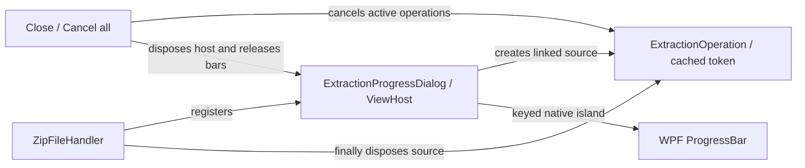

Current local.3 framework packages fix rich Button content upstream and pass functional validation.
Their themed update allocations fail the unchanged gate (+7.81% versus 6%; update time +9.87%).
They remain local integration dependencies. Current evidence lives in vendor/ui-framework;
local.2 history, including its initial failure and successful repeat, lives under history/local.2.

The current tree navigation has no active caller of `ExtractZipFilesInFolderWithProgressAsync`; its old selection-handler callers were commented out before this migration. Extraction service/dialog behavior is tested and available, but automatic ZIP extraction on tree selection is not implemented. Obsolete commented handlers and their unused dialog helper were removed.

### Sample submission fixture (source reviewed September 20, 2026)

`Demo/Submissions` contains two fictitious student folders with .NET 10 console solutions.
`FrameworkMigrationTests.SampleDirectoryRendersRealFilesAndMenus` parses those folders with
`Student.GetStudentsFromFolders`, selects native tree containers, verifies editor text against
the file on disk, and renders the actual workspace/context menus. Seeded comments use a temporary
SQLite database and explicitly say DEMO; no AI request or student execution is performed.
These are offscreen app-control captures, not live desktop screenshots.

File tabs now use keyed framework filename and close buttons with accessible names. Both the
FileTabButtonStyle and CompactCloseButton workarounds are removed. The framework's compact
padding gap remains reported upstream; normal-size close targets avoid it. Tests assert visible
labels/glyphs, independent close actions, and dense feedback/expanded reviews.

### Workspace visual refinement (source reviewed September 23, 2026)

`MainWindow.Framework.cs` restores File/Settings menus beside the saved course/assignment pickers, followed by compact Assignment setup, Open submissions and Batch review actions and a horizontal Feedback/Job queue/Rubric selector. The menu retains its native instance across reactive updates; its existing handlers open the same settings and assignment dialogs.
`ReviewTheme` applies code-built resources from `Presentation/NativeTheme.cs` to native windows, framework hosts, and the
detached file context menu, supplying dark menu, scrollbar, and tool-tab presentation while retaining
WPF controls and commands. File tree width starts at 260 pixels and is resizable. InlineCommentAdorner starts collapsed,
expands on its header action, and collapses after approval; all review actions remain inside expanded
details. Review cards cap at 480 pixels wide. The editable feedback draft remains separate.

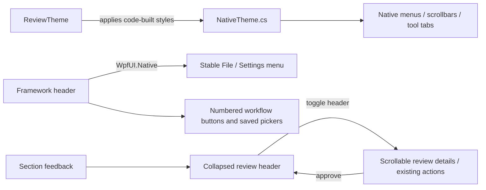

App UI regression captures verify populated file navigation and native menus plus default collapsed
review state. They do not establish a live desktop keyboard/IME audit or app performance improvement.

### Overall feedback attaches to files (source reviewed September 20, 2026)

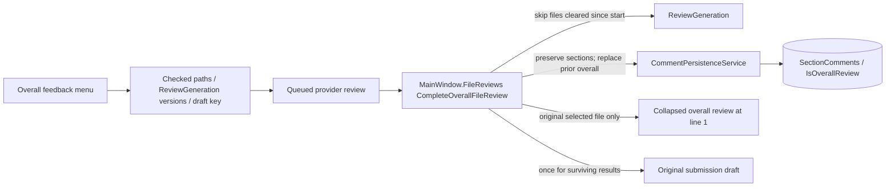

Overall completion previously only appended the session draft. It now persists a typed overall
review for each captured checked file, including files never opened, without overwriting section
reviews or source text. Multi-file reports are explicitly labeled combined feedback, not individual
scores. The current inline overlay updates only for its matching file; switching selection does not
retarget the result. Clear review invalidates captured generations for overall as well as section jobs.
SQLite adds IsOverallReview INTEGER NOT NULL DEFAULT 0; existing comments remain section reviews.
Overall cards omit the unused numeric score; section-only regeneration is disabled for these cards
(use the Overall feedback menu to rerun). Approval/rejection and Clear review retain their workflows.

### Remaining XAML conversion handoff (source reviewed September 20, 2026)

The XAML-removal handoff is complete: App.cs, MainWindow.cs/Framework.cs/NativeControls.cs, Views/GradingView.cs and Presentation/NativeTheme.cs replace the former application XAML. Specialized native controls and sizing adapters remain deliberately; there are no generated application fields, InitializeComponent calls or XAML pack loads. Editor .xshd highlighting resources remain active. ShellMigration build and 187 tests pass; actual-control captures use demo data.

### Grading view duplicate cleanup (source reviewed September 20, 2026)

The declarative framework Views/GradingView.cs is now the sole GradingView type. Obsolete Views/GradeView.xaml and Views/GradeView.xaml.cs were removed; duplicate generated/manual members no longer compile together. Its reactive points binding uses a fallback while switching result models so teardown cannot read a cleared dictionary. GradingViewTests cover score/deduction binding, native editor identity, switching models and host disposal.

## File-tree recycling (September 24, 2026)

`MainWindow.NativeControls.ConfigureFileTree` enables recycling virtualization with virtualizing panels at the root and nested item levels. FileSystemItem owns expansion, selection and analysis-checkbox state through two-way bindings, so recycled containers restore state for the correct file. `MainWindow.FileTreeView_SelectedItemChanged` skips reopening the already-active file, preserving its AvalonEdit document, caret and review state when a selected container is recreated.

`FileTreeVirtualizationTests` and `FileTreeChecks` cover bounded realization with 1,000 files, nested expansion/collapse, offscreen selection, checked-state isolation, automation patterns, actual source-file opening, document/caret retention and host disposal. The full consumer suite passed 189 tests. Performance evidence is described in FILE_TREE_PERFORMANCE.md; the app pins `0.1.0-alpha.3-local.2`.
## Application-owned COM cleanup

App creates the package-provided `WpfComCleanupPolicy` before `MainWindow`.
MainWindow's existing Closed handlers dispose native/framework owners before
App.OnExit drains cleanup. The thread-wide CLR setting lasts until process exit;
the policy is not installed by ViewHost. Failures are logged and counted across
recovery. Real typing, IME, and screen-reader validation remain pending; see
[the acceptance checklist](COM_CLEANUP_POLICY.md). The exact framework package
pin is `[0.1.0-alpha.3-local.2]`.

### Runner setup credential location (source reviewed September 29, 2026)

`Setup-RunnerTemplate.ps1` defaults guest credentials to the executing user's local app-data directory under `GuidedGrade\runner-guest.xml`, accepts an explicit `CredentialPath`, and reports the full path in `setup-status.json`. `New-RunnerAnswerMedia.ps1` exports the credentials for the executing Windows account; setup and runtime should use that same account.

## Queued review isolation and payload boundary (October 5, 2026)

ReviewContext identifies the student folder, course/title and submitted lab folder (the first directory below the student folder, with nested source directories grouped into that lab). MainWindow captures this key before asynchronous work. Section batches also snapshot the rubric, settings, file list, identifier-redaction inputs and search root before yielding. Related-file lookup excludes candidates outside that root. Mixed-lab checked-file reviews are rejected with guidance to select one lab; solution tests restrict checked paths to the selected solution's lab. Student changes detach old editor tabs; file/assignment changes refresh inline cards and drafts.

SQLite migration adds ReviewContext with an empty legacy default and extends the unique index. Existing records are preserved without guessing their assignment: legacy records display only with no assignment selected. New overall replacement, section replacement, rendering and approved-feedback import respect context. Clear review remains explicitly file-wide across contexts. The cache retains all contexts for a file; drafts and import markers still have no eviction or durable edited-draft storage.

Grading payloads contain requirements/rubric criteria and sanitized source text, generic numbered file labels and fixed grading instructions. Student names/IDs, original filenames, course/title, local routing keys, extracted type indexes and runtime reports are not added as metadata. Known identifiers and email/personal-path patterns are redacted in criteria and source; this is not a proof that arbitrary personal information embedded in code can always be recognized. HTTP contract tests inspect both Ollama and Azure request bodies. Interactive testing is an explicit exception: the console driver sends redacted output/history and testing instructions to request one next input, validates it, and writes it to the program input stream. Source remains available for local input validation but is omitted from console-choice requests. Free-form tasks send the text the user deliberately enters, without automatically attaching student files or metadata. Settings connection tests use synthetic criteria/source.

### Request preferences (October 5, 2026)

LLMSettings persists ConsoleModelWaitSeconds (default 30), ConfirmLocalExecution (default true) and ConfirmGrading (default true). AI Provider settings validates the model wait as an integer from 1 through 90 seconds. Invalid saved values use 30 seconds at runtime. ConsoleDriverAgent passes the captured timeout to its per-decision cancellation source; queue waiting and a model correction each remain within the overall 90-second session deadline. This setting does not alter grading HTTP timeouts or memory bounds.

Both settings windows expose separate local-execution and grading confirmation toggles. Saving Programming Checks no longer unconditionally disables local confirmation, and Test with AI locally no longer unconditionally enables it. Manual build/run and queued tests consult the saved local preference. GradingConfirmation gates overall reviews, section batches, selected-section grading, regeneration and post-test grading once per user request; an enabled prompt can be declined before queuing work. Setup, validation, error and completion messages remain independent.

Student-grade persistence (October 6): MainWindow.Grades owns the loaded grade dictionary, saves via GradePersistenceService, and refreshes reactive row/footer views. StudentGradeRow adapts the existing native ListBox selection and recycling to framework-rendered rows, disposing hosts on unload/replacement. Final grades use ReviewContext student/course/assignment/lab keys; they are entered by the instructor and remain separate from AI feedback and programming log scores. GradeTotals sums all recorded earned/possible points for the selected student's current course; ungraded submissions and other courses are excluded. The assignment badge is for the active lab, identified in the submissions header. Editing requires a selected assignment and a file inside the selected student's folder. Grade keys and scores stay local and are not model input. Rename/move migration, category weights, and automatic final-grade extraction from feedback are not implemented.

October 6 approval-transfer source review: CommentLayer_ApproveRequested now persists approval and calls RestoreApprovedFeedback immediately. RestoreApprovedFeedback updates both the scoped draft dictionary and its existing editor state, including when another file shares the lab context. Pending/rejected records are not restored into drafts; existing generated-draft behavior is unchanged. ReviewContext.Matches compares Windows folder/root components without case sensitivity while retaining exact course/assignment separation. SQLite comment reads and replacement deletes also ignore file-path case. PersistCommentsForFile leaves unloaded records untouched; explicit Clear review still deletes them.

October 6 batch source review: MainWindow.BatchReview owns the declarative designer/preview and disposes its host on close. BatchReviewPlan validates relative file lists and same-lab test entry points, snapshots targets, and iterates students serially within one AiTestQueue job. MainWindow captures rubric/settings, identifiers and ReviewContext routing independently of current selection; execution uses saved mode/confirmation policy and writes local reports. GradeFileWithRuntimeReportAsync captures clear-review versions, saves each successful section immediately, optionally approves it and imports the captured student's draft, and refreshes active inline cards. Failure continues to the next student; whole-batch cancellation stops further work and preserves saved comments. Model payload and console privacy rules remain unchanged. Batch configuration/progress are session-only; named recipes and durable resume are not implemented.

October 6 nested batch-path source review: BatchReviewPlan.ValidatePattern allows a leading **/ with a literal relative suffix. Resolve searches only under the current student's folder, skips reparse points, scans all matching paths and selects the newest LastWriteTimeUtc, breaking ties by alphabetical path order, and reports missing/search failures per student. Preview lists resolved paths; queued execution receives exact paths, not patterns. Existing physical ReviewContext routing and same-lab validation remain in place. General glob syntax is not implemented.

October 6 batch replacement source review (supersedes the earlier section-based batch description): ProcessStudentAsync clears the specified files, optionally executes the project once, then reviews files serially. MainWindow.BatchReview uses OverallFeedbackPrompt with one sanitized file per request and CompleteOverallFileReview with captured approval/draft options. ClearBatchFileReview deletes all contexts for only those files, advances generation counters, removes intact generated draft blocks through ReviewDraftCleanup, and resets file import markers; instructor-edited draft text remains. Build/run defaults off and disabled entry paths are ignored during preview. Generation failures after clearing do not restore old reviews. Batch no longer calls GradeFileWithRuntimeReportAsync; individual solution-test grading retains that section-based path.

October 6 batch-display source review: CommentPersistenceService.GetReviewedFiles reads non-rejected file/context locations in saved-time order. MainWindow.Workspace filters them to the selected student's folder and exact assignment/lab context, skips missing files, and opens the most recent matching file on student selection or a Comments request without an active file. Saved-file links refresh after overall results; Job queue exposes the same navigation. Batch completion refreshes the selected review without changing assignments. InlineCommentLayer makes restored cards visible before measuring; overall-file cards use the first visible source line when their line-one anchor is off-screen. Section cards remain line-anchored. Read-only inspection confirmed recent real batch records were present and approved; no user review database writes were performed during diagnosis.

October 6 latest-submission source review: BatchReviewPlan.Resolve now chooses the greatest file modification timestamp (UTC) across all recursive matches; equal timestamps use ordinal case-insensitive path order. Preview displays each chosen path and its UTC modification time. Recursive entry-point resolution stays within the selected review lab. Exact paths are unchanged; multiple review patterns still must resolve within one lab. The captured preview paths are not reselected when execution starts.

October 7 class-folder source review: AssignmentSetupWindow saves the class-wide folder-name toggle through AssignmentPersistenceService into CourseFolderSettings in assignments.db (case-insensitive course key). Missing settings, including PG1 and DSA, default to strict student naming. MainWindow reloads an open folder list on class selection and saved setup, retaining selection by path where possible. No change to review/grade keys or lab-root semantics.

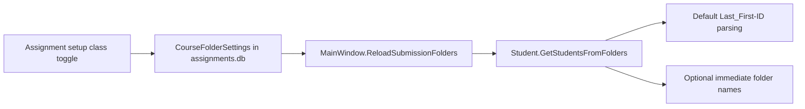

October 7 native PDB collision review: SubmissionBuilder no longer passes a solution-wide IntDir override. Native solution builds retain each project's intermediate paths and use /m:1; direct C++ project builds also use /m:1. Existing OutDir handling remains for unattended post-build copies. C1041 diagnostics explain file locking, separate intermediates, /FS and retrying outside synchronized folders. External locks and project-defined conflicting directories can still fail; no student project files are rewritten.

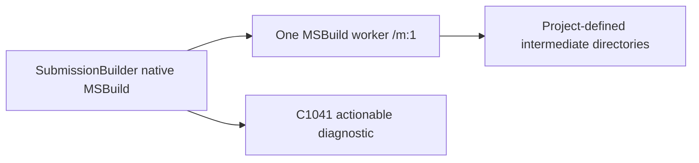

October 7 native launch-directory fix: ResolveWorkingDirectory first maps the launched executable name to a matching .sln project display name and its existing .vcxproj path before the filename heuristic. This handles Lab1.exe from CaveMatchingGame.vcxproj even when the solution output directory points under Practice. Direct project launches still use their project folder. Manual Run reports the full executable and working-directory paths. This fixes relative source/asset lookup for mapped projects; it does not establish that student initialization or graphics loops are correct.

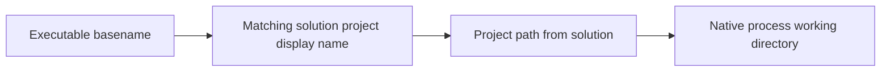

October 7 build diagnostic review: SubmissionBuilder.Combine adds actionable prior-process/file-lock guidance for executable LNK1104 errors; it preserves failure status and never terminates external programs.

October 7 shared-dependency staging review: local AI testing checks literal relative Import paths in vcxproj files for the immediate sibling Shared tree. When referenced, AiTestStaging copies only the submission and Shared into a unique run directory, preserving their sibling layout. Shared/bin DLL and LIB dependencies are retained; compiled executables and incremental artifacts remain excluded. Other repository folders are not copied. Without such an import, existing submission-only staging remains. Dynamic MSBuild imports and other sibling dependency names are not resolved. Staged build failures now require staging/toolchain/dependency/lock checks before attribution to student source. Unique dependency runs currently remain on disk after completion.

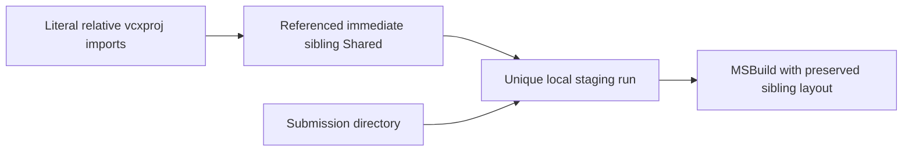

October 7 recording-driven console-agent review: the captured SDL game displayed WASD/arrows, spacebar and ESC while the model invented a numbered exit and typed literal key names. ConsoleDriverAgent stops for that combined control signature only when the session cannot deliver window events. Local sessions now allow model-selected key/click actions. It sends no GUI screens or guessed physical controls to the model. This guard is based on displayed text. Remote VM sessions remain console-only; visual verification remains unsupported. Prompt instructions explicitly forbid implicitly numbered choices and physical-key names in stdin. ConsoleInputPolicy does not constrain a new item/name question to stale menu numbers above it. Menu coverage and validation recognize simple article-bearing prompts such as Choose an option.

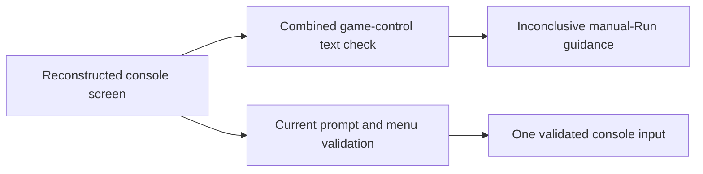

October 7 structured assignment setup source review: AssignmentSetupWindow hosts AssignmentSetupView and AssignmentSetupViewModel. Instructions, rubric, deductions, feedback preferences and class settings each have dedicated View and ViewModel classes. Saved assignment selection, grading-prompt import preview and rubric-only import also use separate views/view models. Setup uses the pinned declarative framework. Prompt import is local and recognizes points-first rows such as **10pts:** and **-10pt deduction:**; it previews replacement, rejects stale previews, removes recognized boilerplate and preserves other instruction text for review. Arbitrary prompt formats are not semantically interpreted.

AssignmentOptions in assignments.db stores deduction rules and feedback preferences alongside legacy SavedAssignments; the two assignment writes are transactional. Legacy records default to an empty deduction list and direct-address feedback. Class folder settings remain shared across the class. Queued snapshots deep-copy deduction/preference data. Overall prompts use the structured preferences; section prompts retain their existing parseable section-response format while receiving tone/evidence/deduction rules. Policy violations and starter-code removal imports require instructor confirmation: the model is asked to flag them rather than apply penalties automatically. These are prompt instructions, not a computed-score enforcement engine; grades remain instructor-entered. No class/title/name metadata is added to model requests.

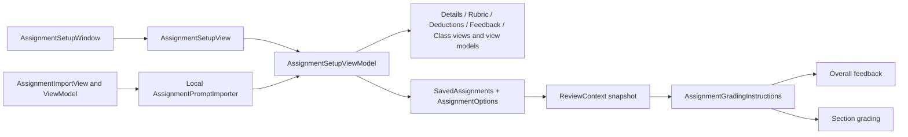

### Minimal review workspace (source reviewed October 7, 2026)

The compact toolbar and horizontal panel selector replace the large workflow banner and separate right navigation rail. The editor retains at least 300 pixels in the native splitter layout; the side panel starts at 380 pixels and opens within 35% of the window (minimum 300). Rubric points and deductions appear first; full assignment instructions use an optional toggle. Feedback drafts, job queue actions, native editor/file tree, grade persistence and console behavior retain their existing coordinators.

Each extracted component has a matching file in Views and ViewModels: WorkspaceToolbar, PanelNavigation, PanelHeader, WorkspaceStatus, ToolsPanelToolbar, FileTabs, WorkspaceEmptyState, ReviewRubric, FeedbackPanel, JobQueue, StudentsPanel, SubmissionFilesPanel, ConsolePanel and ViolationsPanel. StudentGradeRow and GradeBadge also have separate reusable views/models. Models expose reactive bindings and actions; MainWindow still coordinates persistence and native control lifetime.

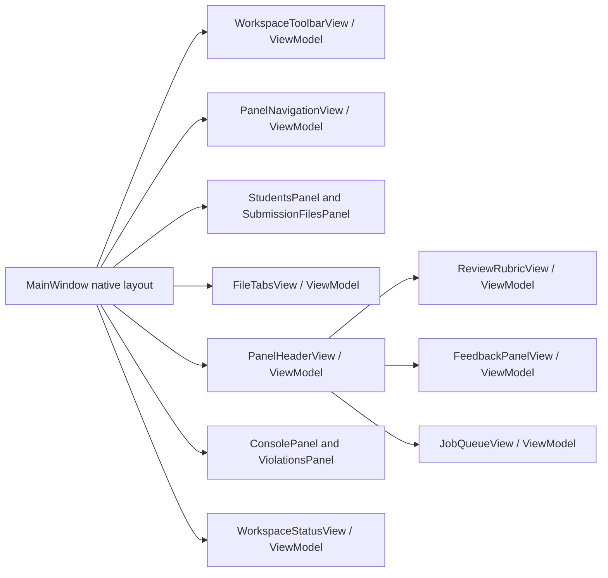

### Database save refresh (source reviewed October 7, 2026)

After successful grade saves/deletes, MainWindow reloads all grade records before notifying grade bindings, keeping course totals synchronized with persisted grades. Comment saves/deletes reload the affected file and notify saved-review links; approval restores feedback from that persisted snapshot and redraws inline cards. Assignment setup reloads the saved assignment and course settings, then the shell reloads course/assignment selectors while retaining the saved selection. Persistence refresh does not replace independent unsaved feedback drafts. There is no automatic polling or cross-process change subscription; refresh is tied to application writes.

```mermaid
flowchart LR
 Save[Successful database mutation] --> Read[Read affected persisted records]
 Read --> Cache[Replace corresponding model snapshot]
 Cache --> Notify[Reactive revision or state update]
 Notify --> UI[Grade badges / review links / assignment selectors]
```

### Workspace presentation refinement (source reviewed October 7, 2026)

One toolbar contains the native menus, submission/batch actions, course/assignment selectors and panel tabs. Assignment setup remains in Settings and rubric Edit assignment. NavigationTabView/ViewModel supplies shared flat underlined tabs for files, panels and console/violations through the pinned framework native adapter. An application-owned attached selected property avoids conflict with framework identity tags. ToolbarLabelView/ViewModel centers short labels vertically. NativeTheme centers button content through ContentPresenter, preserving rich native content, and uses eight-pixel scrollbars. Framework presentation gaps were reported to the authorized CUI chat; package bytes are unchanged.

```mermaid
flowchart LR
 Toolbar[WorkspaceToolbarView] --> Labels[ToolbarLabelView / ViewModel]
 Toolbar --> PanelTabs[PanelNavigationView]
 PanelTabs --> Tab[NavigationTabView / ViewModel]
 Files[FileTabsView] --> Tab
 Tools[ToolsPanelToolbarView] --> Tab
 Tab --> Adapter[WpfUI.Native + NativeTheme selected-tab style]
```

### Course and assignment menu selectors (source reviewed October 7, 2026)

WorkspaceToolbar uses reusable MenuSelectorView/ViewModel native adapters for Course and Assignment, sharing NativeTheme menu presentation with File and Settings. Headers show the current selection; submenu entries mark the selected item and invoke the existing selection handlers. Empty menus explain that no saved entries exist. Adapter identity includes options and selection so successful database refreshes update menu content.

```mermaid
flowchart LR
 Toolbar[WorkspaceToolbarView] --> Selector[MenuSelectorView / ViewModel]
 Selector --> Native[WpfUI.Native Menu / MenuItem]
 Native --> Handlers[SelectCourse / SelectAssignment]
```

### Contextual Review menu (source reviewed October 7, 2026)

ReviewMenuView/ViewModel displays a native menu only after assignment selection. It groups batch, selected-text review, overall review of checked source files, clear checked-file reviews, and clear all assignment reviews. Enabled states are evaluated when opening the menu from the current editor/tree selection. CommentPersistenceService.DeleteAssignmentReviews deletes matching course/title contexts transactionally, optionally restricted to checked files, including rejected reviews. Other assignments and legacy unscoped reviews remain; grade records are unaffected. The coordinator invalidates pending completions for cleared file generations, refreshes persisted file caches, redraws inline cards and removes intact generated draft blocks while preserving instructor edits.

```mermaid
flowchart LR
 Toolbar[WorkspaceToolbar] --> Menu[ReviewMenuView / ViewModel]
 Menu --> Existing[Batch / selection / overall handlers]
 Menu --> Clear[MainWindow.ClearAssignmentReviews]
 Clear --> DB[CommentPersistenceService.DeleteAssignmentReviews]
 DB --> Refresh[Persisted caches / inline cards / draft cleanup]
```

### Earlier section review recovery (source reviewed October 7, 2026)

File/assignment reselection now reloads persisted comments instead of relying on an existing cache. Saved-review discovery includes unscoped legacy records only for files contained in the selected student folder. With an assignment selected, these comments appear as read-only inline cards labeled Earlier review / assignment not recorded, and EarlierReviewsView/ViewModel displays them separately in Feedback. They are not imported into the assignment draft or grade and are not assigned a guessed context. Existing unassigned review workflows retain approval controls. Scoped comments still require exact student/course/assignment/submission identity; rejected comments remain hidden. No user database migration or edits were performed for this compatibility fix.

```mermaid
flowchart LR
 Selection[File or assignment selection] --> DB[Reload saved comments]
 DB --> Scoped[Matching assignment comments]
 DB --> Legacy[Unscoped earlier comments]
 Scoped --> Inline[Inline cards / approved feedback]
 Legacy --> ReadOnly[Labeled read-only inline cards]
 Legacy --> Panel[EarlierReviewsView / ViewModel]
```

Model-driven local window events (source reviewed October 7, 2026): ConsoleDriverAgent accepts structured key/click decisions in addition to console lines/wait/close/stop. The LLM receives testing instructions and sanitized console history plus transport capability instructions; no source, screen pixels or window titles are supplied. WindowInputAction validates a bounded key vocabulary (letters/digits, arrows, Space/Escape/Enter/Tab; no system chords) and normalized click coordinates. InteractiveProcessSession resolves its launched process ID; WindowInputDispatcher finds a visible unowned window belonging to it, verifies foreground ownership and uses SendInput for key down/up or mouse move/down/up. Focus/delivery errors stop inconclusively. The configurable response timeout and 90-second session limit still apply. Click positions must come from testing instructions; visually dependent outcomes remain unverified. HyperVRunner remains console-only. Runner builds link the shared event types, but remote event transport is not implemented.

```mermaid
flowchart LR
 Console[Console output + testing instructions] --> Model[LLM structured decision]
 Model --> Validate[WindowInputAction validation]
 Validate --> Session[InteractiveProcessSession own process ID]
 Session --> Dispatch[WindowInputDispatcher focus + ownership checks]
 Dispatch --> Events[Windows SendInput key/click events]
 Events --> App[Launched program window]
```

October 7 runtime-role correction: the console model system instruction explicitly assigns the runtime operator role, labels assignment prose as reference-only runtime expectations, and forbids switching to grading or requesting source. A stop response claiming missing code/files gets one bounded corrective retry using the same source-free payload; actual focus or interaction limitations still stop. This reduces role confusion but does not guarantee model compliance.

October 7 physical-key parser correction: WindowInputAction accepts equivalent explicit key names (Spacebar/Space, Escape/ESC, Return/Enter and ArrowUp/Up etc.) only for structured key actions; system chords remain rejected. ConsoleDriverAgent reports distinct empty-response, incomplete/malformed JSON and invalid-event errors, with a bounded sanitized model-response sample for failed decisions. The configured local model returned action=key/input=spacebar in a synthetic live controls check, matching the prior parser rejection. No fallback event or additional source payload was introduced.

October 7 window coverage refinement: runtime prompts distinguish initial/unchanged console output from new output and retain full-session movement/selection coverage separately from bounded action history. For advertised game controls, early ESC is rejected with a corrective model retry until assignment-required runtime paths have been accounted for in the model coverage ledger; the final turn still permits cleanup. C# never substitutes keys. This tracks delivered controls, not visually verified outcomes. The model can stop inconclusively when visual evidence is needed.

October 7 assignment-driven coverage: the fixed movement quota is replaced by a model-provided path/status/evidence ledger retained across turns. The operator must enumerate and test all reachable assignment-required paths before exit, retain unfinished paths and separate tested/failed/untested/blocked outcomes. Early game ESC with absent coverage or untested paths receives a corrective retry; blocked outcomes permit cleanup but are explicitly reported inconclusive. Final-turn cleanup remains allowed. The ledger is model-reported, not proof of exhaustive control-flow or visual coverage.

October 8 grading prompt import correction (source reviewed): AssignmentPromptImporter supports both points-first and label-first colon rows, including criterion names containing colons, optional trailing point units and negative penalties. Malformed-row detection requires a numeric points prefix, so numbered prose mentioning points is retained rather than rejected. Output/feedback/response format headings delimit output instructions. The importer remains a deterministic text parser, not semantic rubric extraction.

October 8 COP2334 prompt format verification: label-first rubric rows also accept percentage / explicit point pairs such as 15% / 15 pts, using the explicit point value. Multi-file requirement prose and unspecified deduction notes remain instructions; no numeric penalty is invented. Output-format sections and following submission placeholders are excluded. Instructor-role preambles are stripped from assignment requirements.

Source review 2026-10-08: Shared AssignmentGradingInstructions guides overall and section reviews to locate rubric work via TODO:// labels, TODO section comments, and section-named methods, then verify implementations across supplied files. Markers alone establish neither completion nor missing work; unavailable cross-file context remains unverified.

Source reviewed 2026-10-08: BatchReviewPlan.ProcessStudentAsync clears each selected file, optionally builds/runs once, then submits all selected file contents in one combined overall review per student. One shared review is attached to the selected files through CompleteOverallFileReview. Manual overall review already combines checked files. Overall prompt rules mark unavailable cross-file evidence unverified, withhold numeric final grades for unverifiable criteria, and distinguish rubric scores from configured penalties. These are model instructions, not deterministic score validation; only selected files are supplied, so instructors must select the relevant headers and implementations.

Source reviewed 2026-10-08: The bottom Logs tab uses LogPanelView/LogPanelViewModel through the pinned framework native adapter for source history list/text controls. FsLogReader implements the supplied ResultsDecoder v2 FSLG layout: named files, Unix-second timestamp groups, uint32-sized snapshots with byte-offset-128 decoding using the local ANSI code page. It validates signatures, versions, chunk boundaries and limits (32 MB input, 256 names, 10,000 snapshots). The viewer retains one loaded document as decoded strings, releases its stream after loading, and clears old content on assignment/student refresh. Historical timestamps and source are local viewer data and are not added to LLM payloads or treated as build counts/grades. Log options uses native menu styling alongside the bottom tab navigation.
Assignment setup stores optional relative ReviewFilePaths and LogFilePath in AssignmentOptions JSON; existing records default to empty. Saved paths are validated (optional **/ prefix, no absolute/parent paths), copied into queued snapshots, and prefill batch file selection. Logs resolves the saved .fslog path within the current student folder using newest-match resolution. Without a configured path, it searches the nearest project/solution directory of the active file; no project context yields no automatic log. Manual Open remains available. A configured assignment log can load without opening a source file. Only selected review-file contents and grading criteria are sent to models; path configuration and decoded log history are not sent.

```mermaid
flowchart LR
    AssignmentDetailsView --> AssignmentDetailsViewModel
    AssignmentDetailsViewModel --> AssignmentOptions[AssignmentOptions JSON: review and log paths]
    AssignmentOptions --> BatchFiles[Batch review file selection]
    AssignmentOptions --> LogRouting[Current student log resolution]
    LogRouting --> FsLogReader
    FsLogReader --> LogPanelViewModel
    LogPanelViewModel --> LogPanelView
    LogPanelView --> BottomLogs[Bottom Logs tab]
```

Source reviewed 2026-10-08: WorkspaceStatusView and BuildGradeStatus use reusable ToolbarActionView/ToolbarActionViewModel for flat, keyboard-accessible queue, assignment-grade and violations actions; ToolbarLabelView aligns passive build and course-total labels to the same 32-pixel row. Native adapters preserve existing actions and grade enabled/color state without outlined button backgrounds.

Source reviewed 2026-10-08: The bottom tools tabs and status actions share one ToolsPanelToolbarView row docked below panel content. Console, violation count and Logs navigation, icon log-options menu, queue/build/grade status and icon collapse action are consolidated. Navigation and toolbar actions expose tooltips and retained automation names. Violation count appears once in its navigation tab. Separate component views/view models remain.

Source reviewed 2026-10-08: FsLogSnapshot preserves its serialized timestamp-group ordinal as BuildNumber; FsLogDocument.BuildCount counts those groups, including groups sharing a timestamp, rather than multiplying by file count. FileHandler.ParseFile now decodes fslog instead of parsing binary data as build-output text. LogPanel shows high-contrast source/history, recorded build counts, elapsed span, largest gap and a BuildHistoryView/BuildHistoryViewModel timeline with hover details and click-to-select snapshots. Timeline time spacing includes breaks, not measured active work time. ANSI decoded history remains local and one bounded log is retained; timeline renders marks without creating a control per build.
CourseReviewRules stores instructor-defined rules keyed by course in SQLite, loaded into assignments and immutable review snapshots. Assignment setup Class settings offers a PG2-only preset for no lambdas, header/.cpp separation with getter/setter exceptions and reference/const use from Part B. No preset is automatically enabled. Shared grading instructions ask for verified source evidence and scope checks; they are model review guidance, not deterministic C++ AST checks and do not add entries to the lexical Violations count automatically. Numeric penalties require separately configured assignment deductions.

```mermaid
flowchart LR
    ClassSettingsView --> ClassSettingsViewModel
    ClassSettingsViewModel --> CourseReviewRules[(CourseReviewRules by course)]
    CourseReviewRules --> AssignmentGradingInstructions
    FsLogReader --> BuildHistoryViewModel
    BuildHistoryViewModel --> BuildHistoryView
    BuildHistoryView --> LogPanelView
```

Source reviewed 2026-10-08: Bottom Builds visibility binds to LogPanelViewModel.IsLoaded and its count to RecordedBuildCount reactive state, independent of legacy parsed-result counters. Clear and load failures reset both states. Selection refresh resolves the current assignment log even when the log panel is hidden if a log was loaded, preventing prior-student counts from persisting. A successfully loaded empty log displays zero builds; absence/failure hides the indicator.

Source reviewed 2026-10-08: Assignment feedback settings include independently persisted DetailLevel (1 very brief to 5 thorough; default standard) and ReadingLevel (middle school, high school, college, technical; default high school). FeedbackDialView/FeedbackDialViewModel provides a rotary native-adapter control with drag, wheel and arrow/Home/End input; the reading-level menu uses toolbar menu styling. AssignmentFeedbackViewModel loads/saves these through AssignmentOptions feedback JSON, and ReviewContext snapshots them. Shared grading prompts describe language and explanation depth while preserving rubric/evidence requirements. Changes apply to subsequent generated reviews, not already-saved comments.

Source reviewed 2026-10-08: Very brief/Brief feedback prompt rules now limit each rubric justification to 12/20 words and the feedback paragraph to 35/60 words, forbid duplicate Detailed Review and Evidence/Comments blocks, and prioritize saved length preferences over verbose assignment output-format prose. OverallFeedbackPrompt repeats a final length check and asks models to retain exact rubric rows/maxima and reconcile totals. These are generation instructions, not a deterministic word-count or scoring validator. Dial changes must be saved with the assignment and apply to subsequent requests.

Source reviewed 2026-10-08: Overall feedback records are hidden from inline overlays and displayed in the Feedback side panel. Restore/import identity for overall reports uses assignment context, section label and report text, excluding file path, so the same combined report stored against several files restores once. Section-specific reviews retain file/line identity. Pending overall reports have a separate OverallReviewPanelView/ViewModel with approval action in the side panel. Per-file overall persistence is retained for file discovery and clearing; this is presentation/import deduplication, not a new assignment-review database schema.

Source reviewed 2026-10-09: Both manual and batch multi-file rubric reviews use OverallReviewService and OverallReviewResult rather than accepting free-form model totals. Criterion IDs map to exact configured rubric rows; C# rejects missing/duplicate rows, invalid ranges and invented deduction IDs, calculates totals from earned points and configured penalties, and keeps instructor-confirmation penalties pending. Verified findings require exact source excerpts from the indicated supplied file; unsupported findings become unverified and withhold the final grade. Renderer enforces saved brief paragraph/justification word caps and enabled output sections. Source-quote matching proves the excerpt exists, not the correctness of model interpretation; semantic review still requires instructor oversight. No-rubric qualitative requests retain the text path.
Ollama combined structured reviews explicitly set temperature zero and estimate context needs from prompt characters plus output headroom, with an 8,192-token minimum and 32,768-token ceiling. Oversize estimates reject the request before HTTP; CPU fallback retains the context setting. Estimates are not tokenizer-accurate and do not prove all code is attended to. Azure receives the same JSON contract through its existing completion transport; schema enforcement is local validation, not provider constrained decoding. File payloads retain anonymous IDs/extensions and explicit end boundaries; no student paths or log history are added.
Replacing an overall file review removes matching intact old generated draft blocks, including legacy combined-report prefixes, before presenting the new review. Instructor-edited blocks remain. Multi-file completion persists one shared result per selected file for discovery while the side panel imports the shared report once.

```mermaid
flowchart LR
    ManualOverall[Manual multi-file review] --> OverallReviewService
    BatchOverall[Batch student review] --> OverallReviewService
    OverallReviewService --> Provider[Ollama schema / Azure JSON contract]
    Provider --> OverallReviewResult
    OverallReviewResult --> Evidence[Exact excerpt and rubric-range validation]
    Evidence --> Totals[C sharp score calculation and formatting]
    Totals --> SideFeedback[Overall side-panel feedback]
```

Source reviewed 2026-10-09: OverallReviewResult.SchemaFor constrains rubric row count and allowed IDs to the captured assignment. OverallReviewService retries one malformed structured response with numeric mismatch diagnostics using the original sanitized source, never re-echoing model text. If the second response is otherwise parseable but missing/duplicating rows, only uniquely returned criteria are retained; missing/conflicting rows become explicitly unverified, generic incomplete feedback replaces the model summary, and the final grade is withheld. Invalid JSON, impossible points or invented deductions still fail without publishing. No zero scores are fabricated for absent model findings.

Source reviewed 2026-10-09: After the single correction attempt, an invalid structured response is retained as raw editable feedback with a needs-instructor-review warning rather than discarded. Batch auto-approval is disabled for these drafts and withheld-grade results. They remain pending overall side-panel feedback for editing/approval; no numeric grade record is saved automatically. Transport failures still report errors. This supersedes earlier documentation stating all invalid second replies fail without publishing.

Source reviewed 2026-10-09: Invalid structured reviews are formatted as normal editable rubric/feedback drafts rather than raw JSON. ReviewWarningEnvelope separates normal display text from diagnostics for transport to completion; CompleteOverallFileReview strips the envelope and stores warning details in overall SectionFeedback.Issues using existing persistence. Warning-bearing results remain pending. ReviewWarningView/ViewModel displays a tooltip warning symbol and click-open details dialog next to the pending overall draft. Details identify missing/duplicate criteria, out-of-range score mapping and source quotes that do not match. Diagnostics remain outside exported student-facing feedback text. Unparseable replies retain editable prose with a separate warning. No suggested numeric final grade is manufactured for invalid drafts.

Source reviewed 2026-10-09: ReviewerRoleView/ReviewerRoleViewModel adds a per-assignment editable reviewer-role field and reset action under Feedback preferences. AssignmentFeedbackOptions.ReviewerRole persists in existing AssignmentOptions JSON, defaults to an experienced C++ instructor for older/blank settings, and is deep-copied into queued snapshots. Shared AssignmentGradingInstructions includes the role for manual, batch and section reviews; overall prompt sanitization covers its text. The role controls teaching perspective and tone; app-side rubric validation/calculation and privacy handling remain independent. Role changes apply only to subsequently generated reviews after saving the assignment.
