# Lab Feedback dependency knowledge graph

Latest affected-path source review: September 25, 2026 (explicit experimental COM cleanup ownership, failure reporting and shutdown; file-tree virtualization and active-file selection retention retained). Reviewed C# startup, shell composition, native control ownership, declarative file tabs/pickers/navigation/status, code-built native styles, panel state and disposal. All application-owned XAML has been removed. Nullable contracts and student folder validation were also reviewed; discovery skips malformed entries, and missing Ollama content retains the existing no-response fallback.

Source-reviewed map of the working tree, updated September 23, 2026 (restored File/Settings menus and numbered workflow toolbar; UI-framework hosts/state/lifecycle, native dark styles, review toolbar and collapsed review cards, retained native islands and extraction cancellation, file Clear review persistence/cache invalidation, native post-build paths and Console diagnostics, explicit overall/section feedback menus, overall rubric prompts, saved execution preferences and run-only worker path reviewed; job scheduling, provider cancellation, GPU-memory fallback, pinned workspace tabs, visibility persistence and section detection reviewed). Arrows are labeled with the relationship: calls/uses, data flow, ownership, or implementation. This maps the application components and support tools rather than every method. Grouped nodes expand in the component tables below.

## Application overview

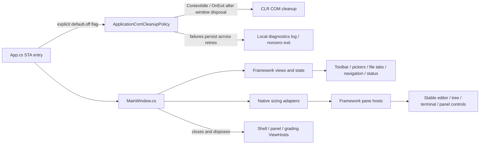

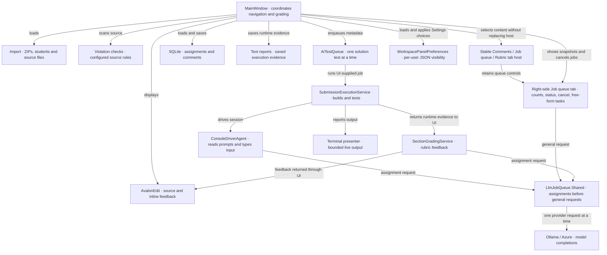

`LlmJobQueue.Shared` serializes provider requests process-wide; assignments precede waiting general jobs without interrupting active requests. The right-side queue tab shows solution jobs and model requests separately; its status indicator counts both levels separately. `AiTestQueue` wraps another scheduler instance to preserve whole-test execution/disposal ordering and solution-path deduplication. Cancelling a solution propagates to execution and runtime grading. Cancelling an individual model request does not cancel unrelated requests or the entire grading batch.

`MainWindow` is the main coordination point. Queue jobs are delegates supplied by it: `AiTestQueue` does not itself reference execution or grading services. Runtime reports reach section grading through that delegate, after execution and disposal complete.

## Execution and isolation

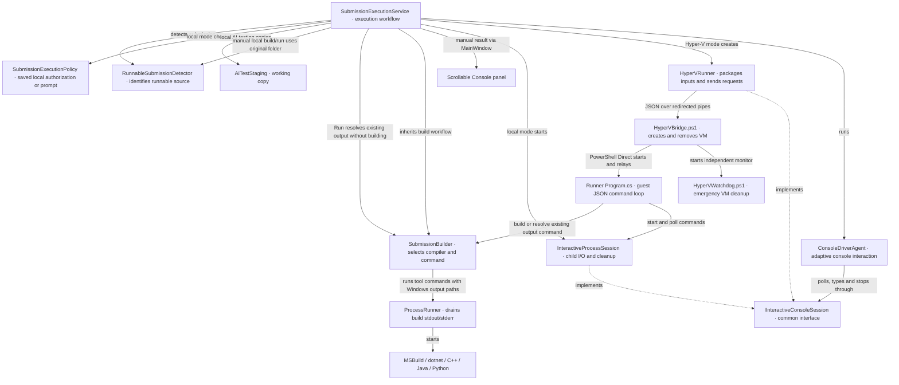

The guest worker compiles shared execution sources directly; it does not load the WPF application. Local tests and Hyper-V tests share the same console capture implementation. The queue awaits service disposal, but emergency watchdog cleanup can outlive a failed bridge; this is not a machine-wide VM lock.

| Component | Responsibility and important dependencies |
| --- | --- |
| `SubmissionExecutionService` | Chooses local/Hyper-V execution, gathers source context, creates runtime reports; also exposes Build, Build and Run, and Run without compilation. Manual local actions use the original submission directory, so a later Run finds built output. |
| `SubmissionBuilder` | Chooses language-specific build commands and resolves runnable outputs. Uses `ProcessRunner`, the detector and installed toolchains. |
| `RunnableSubmissionDetector` | Finds solutions, projects, source languages and runnable outputs; filters irrelevant directories. |
| `AiTestStaging` | Copies local test inputs to a staging directory and rewrites original path references. |
| `NativeDependencyStager` | Finds/copies DLL dependencies and supplies extra runtime PATH directories. |
| `PEHeaderReader` | Determines whether a Windows executable uses the console subsystem, guiding ConPTY selection. |
| `InteractiveProcessSession` | Starts child processes, pumps redirected or ConPTY I/O, waits for idle, writes input and disposes native/process resources. |
| `IInteractiveConsoleSession` | Allows the console agent to use the local session and Hyper-V proxy through the same API. |
| `HyperVRunner` | Validates configuration, packages input archives and drives the bridge protocol; exposes guest status/output to the agent. |
| `Lab Feedback Runner/Program.cs` | Handles build/start/poll/input/close/kill JSON commands in the worker process. |
| `ConsoleDriverAgent` | Alternates observing output and asking the model for the next input; tracks findings, bounded turns and runner termination. |
| `ConsoleScreen` | Maintains a bounded readable projection of cursor-positioned terminal output for the agent; separates current screen/cursor context from history. See [console interaction](CONSOLE_INTERACTION.md). |
| `ConsoleInputPolicy` | Converts displayed menu labels to keys and validates single integers when the matching C++ input-read source provides evidence; failed validation requests one model correction. |
| `ConsoleSourceContext` | Selects input-reading source excerpts for the console-agent prompt, including companion headers discovered by the execution service. |
| `NativeExitCodes` | Classifies/describes Windows exit codes for reports. |
| `SubmissionExecutionPolicy` | Accepts the saved Local preference with prompts disabled, or asks for per-operation consent. Isolation failure never grants local execution. |
| `AdversarialInputPlanner` | Prompt/parser and default cases for adversarial inputs. Currently has no production caller in the WPF source; it is not the active console driver. |

## Output and memory ownership

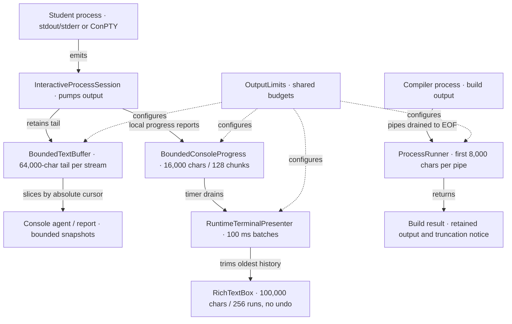

For Hyper-V, the worker sends bounded output through its JSON protocol and `HyperVRunner` forwards it into the host mailbox. `AiTestQueue` bounds concurrent work and waiting-job count separately from these output budgets. See [output memory limits](MEMORY_LIMITS.md) for exact policies, tests, deployment notes and remaining risks.

## Grading, models and persistence

```mermaid
flowchart TD
    UI["MainWindow · assembles context and handles review"]
    Context["RelatedFileResolver · headers and companion source"]
    Grade["SectionGradingService · rubric prompt and parsed feedback"]
    Sanitize["StudentDataSanitizer · removes identifiers"]
    Agent["ConsoleDriverAgent · next-input prompt"]
    Route["LlmCompletionService · provider selection"]
    Jobs["LlmJobQueue.Shared · priority and cancellation"]
    Ollama["OllamaService · local model HTTP calls"]
    Azure["AzureOpenAIService · Azure HTTP calls"]
    Feedback["SectionFeedback · issues, suggestions and review state"]
    Overlay["InlineCommentLayer + Adorner · review controls"]
    Comments["CommentPersistenceService · SQLite comments"]
    Assignment["AssignmentPersistenceService · SQLite rubric library"]
    Settings["LLMSettings · provider, execution and model settings"]
    UI -->|resolves dependencies| Context
    UI -->|explicit section action: source and rubric; runtime path adds report| Grade
    UI -->|explicit overall action: captured assignment and checked source files| Overall[OverallFeedbackPrompt]
    Overall -->|combined rubric review prompt| Ollama
    Overall -->|combined rubric review prompt| Azure
    Grade -->|sanitizes prompt context| Sanitize
    Errors["LlmHttpErrors · bounded server error details"]
    Ollama -->|GPU out-of-memory: one CPU retry in same job| Ollama
    Ollama -->|formats failed HTTP responses| Errors
    Azure -->|formats failed HTTP responses| Errors
    Ollama -->|enqueues HTTP delegate| Jobs
    Azure -->|enqueues HTTP delegate| Jobs
    UI -->|free-form prompt through LlmCompletionService| Route
    Grade -->|selected provider| Ollama
    Grade -->|selected provider| Azure
    Screen["ConsoleScreen · readable current terminal state"]
    Agent -->|feeds received terminal updates| Screen
    Screen -->|screen and cursor context| Agent
    InputPolicy["ConsoleInputPolicy · menu keys and input validation"]
    SourceContext["ConsoleSourceContext · input-reading excerpts"]
    Agent -->|checks before typing| InputPolicy
    Agent -->|builds prompt context| SourceContext
    Agent -->|requests validated JSON action| Route
    Route -->|selected provider| Ollama
    Route -->|selected provider| Azure
    Settings -.->|configures| Grade
    Settings -.->|configures| Route
    Grade -->|returns| Feedback
    UI -->|renders feedback| Overlay
    UI -->|Clear review deletes file records| Comments
    UI -->|Clear review invalidates pending section publication| Generation[ReviewGeneration]
    UI -->|Clear review removes visible comments| Overlay
    Overlay -->|approve, reject, regenerate events| UI
    UI -->|loads and saves feedback| Comments
    UI -->|loads and saves assignment definitions| Assignment
```

| Component | Responsibility |
| --- | --- |
| `RelatedFileResolver` | Finds paired files/includes and extracts declared types so related definitions can be included in grading. |
| `OverallFeedbackPrompt` | Captures assignment requirements and rubric instructions for one combined review of checked files; requests criterion scores and one total, or qualitative feedback when no rubric exists. Includes sanitized source supplied by MainWindow. |
| `SectionGradingService` | Sanitizes source, builds a rubric-based prompt, calls the selected provider and parses `SectionFeedback`. |
| `StudentDataSanitizer` | Redacts student identifiers, emails and personal paths; supplies anonymous display names. |
| `LlmCompletionService` | Routes console-agent completion requests using `LLMSettings`. Section grading calls provider services directly. |
| `OllamaService` / `AzureOpenAIService` | HTTP adapters for model analysis/completion. Model memory is outside the WPF output budgets. |
| `CommentPersistenceService` | Stores feedback keyed to files/sections, including review state, in `section-comments.db`. |
| `AssignmentPersistenceService` | Stores course/assignment requirements and rubric definitions in SQLite. |
| `InlineCommentLayer` | Positions feedback alongside AvalonEdit lines and relays review events. |
| `InlineCommentAdorner` | Owns a disposable framework ViewHost with expanded/approved state, bounded scrollable details and approve/regenerate/reject events. |

## Import, navigation and grading interface

```mermaid
flowchart TD
    UI["MainWindow · folder/file navigation"]
    Zip["ZipFileHandler · validates and extracts ZIPs"]
    Progress["ExtractionProgressDialog · progress and cancellation"]
    Student["Student / Assignment · submission folders"]
    File["FileHandler · discovers source, parses logs/results"]
    Tree["FileSystemItem · checked/expanded tree nodes"]
    Config["ViolationsConfigService · terms and file patterns"]
    Match["ViolationsMatcher · source matches and context"]
    Highlight["ViolationHighlighter · AvalonEdit backgrounds"]
    GradeView["GradingView · scores, deductions and feedback text"]
    UI -->|owns and disposes declarative panels| Host[ViewHost from SignalNotNoise.UI.Wpf]
    Forms[ReviewWindow settings and grading forms] -->|owns and disposes| Host
    Theme[ReviewTheme] -->|tokens and inherited colors| Host
    State[State and StateList] -->|reactive descriptions| Host
    Host -->|native WPF renderer| Native[Windows controls]
    UI -->|retains specialized native controls| Native
    Zip -->|reports extraction work| Progress
    UI -->|discovers folders| Student
    Student -->|folder parsing helpers| File
    UI -->|opens files and loads results| File
    UI -->|populates| Tree
    UI -->|loads rules| Config
    UI -->|passes rules and source| Match
    UI -->|passes matched lines| Highlight
    UI -->|loads results and student| GradeView
```

| UI or model | What it represents / does |
| --- | --- |
| `App.cs` | Explicit STA entry point creates Application/MainWindow and uses OnMainWindowClose shutdown. ReviewTheme supplies the app palette; no generated startup or XAML load remains. |
| `MainWindow` | Owns the editor, navigation, solution queue, grading commands, comment cache and runtime terminal. `MainWindow.JobQueue.cs` refreshes the independent right-side queue tab and count indicator, routes cancellation, and submits free-form tasks. |
| `LlmJobQueue` | Thread-safe assignment/general priority scheduler, used process-wide by providers and separately by the solution wrapper. Bounded active/pending count and completed snapshots; cancellation tokens reach HTTP calls. |
| `SettingsWindow` | Edits violation terms and scanned file patterns. |
| `LLMSettingsWindow` | Edits/test-connects model providers and configures execution mode, worker folder and VM inputs. |
| `AssignmentSetupWindow` | Edits/saves course requirements and rubric items. |
| `SectionGradingDialog` | Selects rubric items for a section. |
| `ExtractionProgressDialog` | Framework operation cards with native progress bars; cancellation on close; worker-owned token sources. Sources: `Views/ExtractionProgressDialog.cs`, `Views/ExtractionOperation.cs`. |
| `GradingView` | Declarative score, deduction and remarks view in `Views/GradingView.cs`; native HTML editors and sliders retain specialized editing behavior. Produces feedback HTML. |
| `Student` | Student identity and folder, with folder discovery/parsing. Validates the Last_First-ID folder format; discovery skips invalid folders and continues loading valid students, logging validation failures to Debug. |
| `Assignment` | Submission assignment folder discovery and consolidation. Distinct from the rubric definition below. |
| `GradingAssignment` / `RubricItem` | Course, requirements, rubric criteria, points and grading totals. |
| `SectionFeedback` / `FeedbackReviewStatus` | Per-section findings, suggested code/score and pending/approved/rejected state. |
| `FileSystemItem` | File/folder tree state, selection flags and child nodes. |
| `LabResults` / `TestResult` | Imported test-result data from `AssignmentResults.cs`. |
| `Result` | Parsed legacy log summary item. |
| `Deduction` | Score reduction or automatic-zero choice. |
| `Violation` | A matched rule with line/context information. |
| `LLMSettings` / `LLMProvider` / `SubmissionExecutionMode` | JSON-backed model and execution preferences. |
| `InverseBoolToVisibilityConverter` | Converts view state to WPF visibility. |

## Projects, libraries and support tools

| Boundary | Connected components and purpose |
| --- | --- |
| `Lab Feedback WPF.csproj` | Windows .NET 10 app. Uses pinned SignalNotNoise.UI.Wpf local packages for declarative surfaces, native WPF islands/AvalonEdit for specialized controls, Microsoft.Data.Sqlite/SQLitePCLRaw for persistence. |
| `Lab Feedback Runner.csproj` | Separate worker executable. Compiles shared builder, detector, process/session, dependency, PE-header and bounded-output sources. |
| `Lab Feedback WPF.Tests.csproj` | MSTest service, queue, output, WPF presenter and worker integration tests. |
| `HyperVBridge.ps1` | VM lifecycle, archive transfer and JSON request relay to guest worker. |
| `HyperVWatchdog.ps1` | Stops the exact owned VM if its bridge disappears or its lifetime expires. |
| `Inspect-RunnerHost.ps1` | Host diagnostics including virtualization and available memory. |
| `Setup-RunnerTemplate.ps1`, `Invoke-RunnerTemplateSetup.ps1`, `Install-RunnerGuestTools.ps1` | Prepare the reusable Windows guest/template and its development tools. |
| `New-RunnerAnswerMedia.ps1`, `Download-RunnerIso.py` | Setup support for unattended answer media and installation media. |
| `Resources/*.xshd` | AvalonEdit syntax/theme definitions. |
| `AI_TEST_QUEUE.md`, `MEMORY_LIMITS.md`, `EXECUTION_SAFETY.md` | Queue behavior, output budgets and runner deployment/consent documentation. |

This graph is a documentation snapshot. Update it when a service is added, a call path changes, or memory ownership moves. Remaining memory work is concentrated in `MainWindow`'s feedback cache/eager tree and whole-file reads in `FileHandler`/source-context construction.

### Menu coverage planner
ConsoleDriverAgent uses ConsoleScreen.MenuContext to supply visible rows through the cursor to ConsoleMenuCoverage. ConsoleMenuCoverage tracks selections per heading and option list, schedules exit choices last, and returns coverage summaries to the agent report. ConsoleInputPolicy validates the chosen key before InteractiveProcessSession sends it. The model handles prompts that the planner does not recognize.

## Review workspace and feedback flow

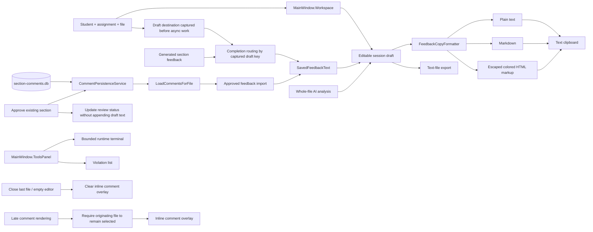

Draft edits stay in memory; the arrow from SQLite imports original section records and does not save edited drafts back. Import tracking avoids repeated appends within a session. Tool-tab collapse frees the bottom content row without clearing capture buffers. See [feedback workspace documentation](FEEDBACK_WORKSPACE.md) for limitations and review findings.

## Decimal scores and rubric validation

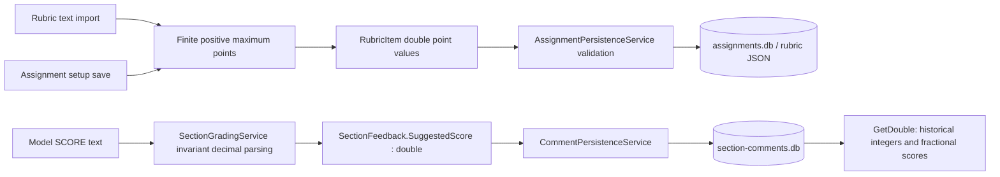

New section-score columns use REAL affinity. Existing SQLite INTEGER-affinity columns can retain fractional values; no destructive table migration is required. Setup and persistence validation reject nonfinite or nonpositive rubric maxima. DecimalFeedbackTests cover decimal parsing under a non-English culture and compatibility with an existing INTEGER-affinity column.

### Current behavioral boundaries
- Batch and queued grading capture the destination draft before awaiting work. Results for another selection remain in that draft rather than opening the currently selected student's panel.
- Approval persists status without republishing feedback. Generated sections and restored approved sections share import tracking and SavedFeedbackText.
- Empty-editor transitions clear inline overlays. RenderCommentsForFile ignores late results for a file that is no longer selected.
- Draft edits remain session-only; section persistence is still file-keyed rather than assignment-keyed. See FEEDBACK_WORKSPACE.md for remaining limitations.

### Maintenance
Update affected diagrams and component descriptions in the same change as dependency, workflow, persistence, or memory-ownership changes. Document implemented behavior separately from planned work. The date above records the latest source-checked update, not an automated synchronization guarantee.

### Provider failure handling (source reviewed September 16, 2026)

Ollama reads HTTP error bodies before throwing. A server error explicitly mentioning CUDA/GPU and out-of-memory triggers one retry of the same prompt with `num_gpu: 0`, within the current queue job. Structured-response schema and temperature are preserved; cancellation prevents further attempts. Other HTTP failures are not retried. `LlmHttpErrors` extracts Ollama/Azure error messages and caps displayed details at 4,000 characters while retaining HTTP status. A failed CPU retry advises checking the runner log. CPU execution can be slower and requires host RAM; no persistent settings are changed. A short live CPU probe succeeded with the configured `gemma4:e2b`; full assignment recovery has not been live-tested.

### Pinned workspace panels (September 17, 2026)

`MainWindow.Panels.cs` applies per-user Comments and Job queue visibility from `WorkspacePanelPreferences`, stored in `%APPDATA%/LabFeedbackWPF/workspace-panels.json`. Both default to visible; missing or unreadable settings fall back to defaults. Settings saves visibility independently of folder violation configuration. The right rail stays visible when content collapses; Comments, Job queue, and Rubric select dedicated tab content. Workspace navigation no longer replaces `sidePanelContent.Child`. Hidden queue visibility also hides its status-bar shortcut, without cancelling jobs. Hidden comments still collect draft updates. Inline comments are clipped to the editor viewport.

### File actions and execution preference (source reviewed September 20, 2026)

The file-tree context menu always exposes Open in File Explorer and Refresh. Explorer selects files and opens directories; solution-only Programming tools contains Build, Build and Run, Run, and AI testing. Settings saves Local/VM and disables repeated local prompts in `LLMSettings`; LLM Settings exposes the same environment and an optional per-operation prompt checkbox. Existing settings retain their prior prompting behavior until saved. The explicit Test with AI locally command still requests one-time consent.

Run resolves existing output without invoking a compiler. The guest worker supports a `resolve` command in addition to `build`; both prepare the subsequent `start` command. VM runs use output already present in the uploaded submission. Disposable VM builds are not copied back to the host or retained for subsequent VM actions. Manual VM runs retain the existing bounded output-capture behavior and do not provide an interactive desktop. Local manual builds write to the selected submission, with dotnet solution fallback output under `bin/LabFeedback`; AI tests still stage copies.

### Explicit feedback scope (source reviewed September 20, 2026)

File-tree overall and section actions have separate handlers; assignment selection no longer silently switches overall analysis into section grading. Overall results use `PresentGeneratedFeedback` and the captured draft key; they do not populate per-section persistence or auto-apply grades. The explicit section path requires a rubric and reports files with no detected sections instead of grading whole files. Runtime grading retains its existing fallback; unused current-file helpers were removed. Function detection is still a line-oriented heuristic requiring the opening brace on the signature line. See FEEDBACK_WORKSPACE.md for the complete scope and persistence behavior.

### Native build failure handling (source reviewed September 20, 2026)

`SubmissionBuilder.BuildMsBuildArguments` preserves Windows backslashes in native output/intermediate paths and escapes the trailing separator for Windows argument parsing, avoiding the forward-slash destination ambiguity shown by xcopy post-build steps. Native solution failures return the MSBuild result instead of falling through to dotnet clean/build. Timed-out MSBuild attempts likewise do not retry. Builds remain bounded to 90 seconds, never treat a failed build's leftover executable as successful, and prepend timeout/copy-prompt explanations to retained tool output. Manual results flow through MainWindow.ShowBuildRunResult to the existing bounded Console presenter rather than an unbounded-size MessageBox. A real MSBuild/xcopy regression fixture verifies paths containing spaces; arbitrary student build scripts can still fail or require input and are not silently rewritten.

### Clear review ownership (source reviewed September 20, 2026)

The file-tree Clear review handler calls `CommentPersistenceService.DeleteComments` (case-insensitive file match), advances `ReviewGeneration`, removes `_fileComments[filePath]`, and clears the selected editor's overlay. Storage failure leaves cache/overlay intact. `ReviewGeneration` is a UI-thread-owned per-file counter map; active section grading and regeneration compare captured versions before publishing, saving, or rendering results. Whole-submission draft feedback remains separate and is not deleted. Import markers remain because the combined draft is preserved. Future or not-yet-started queued file reviews can create new records.

### UI framework migration (source reviewed September 20, 2026)

`MainWindow.Framework.cs` owns the native File/Settings menu through WpfUI.Native, declarative workflow toolbar/pickers, keyed file tabs, status and navigation hosts. Its focused native layout adapter supplies constrained vertical fill, splitter sizing and horizontal tab scrolling, absent from the pinned framework. `MainWindow.NativeControls.cs` owns stable source/terminal documents, tree/list selection, context menus and the independent panel TabControl. Settings, provider/assignment dialogs, review cards and panels use `View`, `State`, `StateList` and `ViewHost`. MainWindow disposes shell, panel, root and grading hosts on close; replaced feedback/rubric hosts and removed cards are also disposed. Draft bindings target the captured student/assignment. A framework toggle exposes the retained declarative GradingView through native interop.

The WPF-UI dependency and its resource dictionaries/chrome were removed. Five obsolete form/extraction XAML files and unused private grading helpers were removed; declarative form classes now use ordinary .cs filenames. `NuGet.Config` restores pinned local prerelease packages from `vendor/ui-framework`; source provenance/license accompanies the feed. Native editor/tree/menus/splitters/console and programming-results controls retain existing platform behavior inside the root adapter. Extraction now renders framework cards with keyed native progress bars. Closing cancels active operations; `ZipFileHandler` disposes each linked source in its worker finally, and cached token values remain safe after disposal. Late updates cannot revive cancelled or closed UI. See UI_FRAMEWORK_MIGRATION.md for exact coverage, limitations, and framework-agent reports. App rendering/behavior tests do not establish performance improvement or live keyboard/IME coverage.

### Extraction ownership after migration (September 20, 2026)

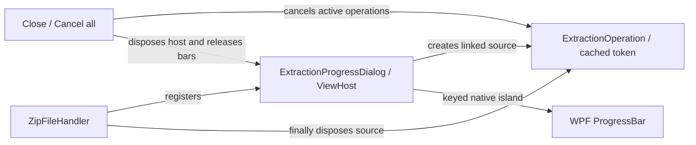

Current local.3 framework packages fix rich Button content upstream and pass functional validation.
Their themed update allocations fail the unchanged gate (+7.81% versus 6%; update time +9.87%).
They remain local integration dependencies. Current evidence lives in vendor/ui-framework;
local.2 history, including its initial failure and successful repeat, lives under history/local.2.

The current tree navigation has no active caller of `ExtractZipFilesInFolderWithProgressAsync`; its old selection-handler callers were commented out before this migration. Extraction service/dialog behavior is tested and available, but automatic ZIP extraction on tree selection is not implemented. Obsolete commented handlers and their unused dialog helper were removed.

### Sample submission fixture (source reviewed September 20, 2026)

`Demo/Submissions` contains two fictitious student folders with .NET 10 console solutions.
`FrameworkMigrationTests.SampleDirectoryRendersRealFilesAndMenus` parses those folders with
`Student.GetStudentsFromFolders`, selects native tree containers, verifies editor text against
the file on disk, and renders the actual workspace/context menus. Seeded comments use a temporary
SQLite database and explicitly say DEMO; no AI request or student execution is performed.
These are offscreen app-control captures, not live desktop screenshots.

File tabs now use keyed framework filename and close buttons with accessible names. Both the
FileTabButtonStyle and CompactCloseButton workarounds are removed. The framework's compact
padding gap remains reported upstream; normal-size close targets avoid it. Tests assert visible
labels/glyphs, independent close actions, and dense feedback/expanded reviews.

### Workspace visual refinement (source reviewed September 23, 2026)

`MainWindow.Framework.cs` restores File/Settings menus beside the saved course/assignment pickers, followed by the Assignment review heading and numbered Assignment, Open submissions, Review with rubric and Feedback workflow actions. The menu retains its native instance across reactive updates; its existing handlers open the same settings and assignment dialogs.
`ReviewTheme` applies code-built resources from `Presentation/NativeTheme.cs` to native windows, framework hosts, and the
detached file context menu, supplying dark menu, scrollbar, and tool-tab presentation while retaining
WPF controls and commands. File tree width starts at 260 pixels and is resizable. InlineCommentAdorner starts collapsed,
expands on its header action, and collapses after approval; all review actions remain inside expanded
details. Review cards cap at 480 pixels wide. The editable feedback draft remains separate.

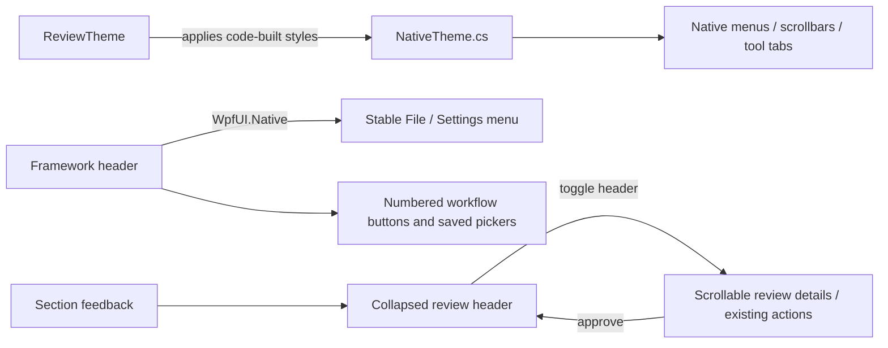

App UI regression captures verify populated file navigation and native menus plus default collapsed
review state. They do not establish a live desktop keyboard/IME audit or app performance improvement.

### Overall feedback attaches to files (source reviewed September 20, 2026)

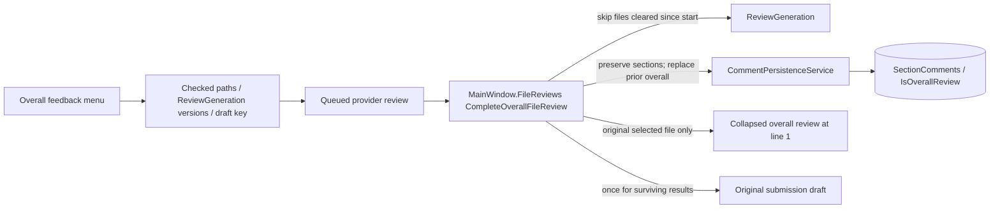

Overall completion previously only appended the session draft. It now persists a typed overall
review for each captured checked file, including files never opened, without overwriting section
reviews or source text. Multi-file reports are explicitly labeled combined feedback, not individual
scores. The current inline overlay updates only for its matching file; switching selection does not
retarget the result. Clear review invalidates captured generations for overall as well as section jobs.
SQLite adds IsOverallReview INTEGER NOT NULL DEFAULT 0; existing comments remain section reviews.
Overall cards omit the unused numeric score; section-only regeneration is disabled for these cards
(use the Overall feedback menu to rerun). Approval/rejection and Clear review retain their workflows.

### Remaining XAML conversion handoff (source reviewed September 20, 2026)

The XAML-removal handoff is complete: App.cs, MainWindow.cs/Framework.cs/NativeControls.cs, Views/GradingView.cs and Presentation/NativeTheme.cs replace the former application XAML. Specialized native controls and sizing adapters remain deliberately; there are no generated application fields, InitializeComponent calls or XAML pack loads. Editor .xshd highlighting resources remain active. ShellMigration build and 187 tests pass; actual-control captures use demo data.

### Grading view duplicate cleanup (source reviewed September 20, 2026)

The declarative framework Views/GradingView.cs is now the sole GradingView type. Obsolete Views/GradeView.xaml and Views/GradeView.xaml.cs were removed; duplicate generated/manual members no longer compile together. Its reactive points binding uses a fallback while switching result models so teardown cannot read a cleared dictionary. GradingViewTests cover score/deduction binding, native editor identity, switching models and host disposal.

## File-tree recycling (September 24, 2026)

`MainWindow.NativeControls.ConfigureFileTree` enables recycling virtualization with virtualizing panels at the root and nested item levels. FileSystemItem owns expansion, selection and analysis-checkbox state through two-way bindings, so recycled containers restore state for the correct file. `MainWindow.FileTreeView_SelectedItemChanged` skips reopening the already-active file, preserving its AvalonEdit document, caret and review state when a selected container is recreated.

`FileTreeVirtualizationTests` and `FileTreeChecks` cover bounded realization with 1,000 files, nested expansion/collapse, offscreen selection, checked-state isolation, automation patterns, actual source-file opening, document/caret retention and host disposal. The full consumer suite passed 188 tests. Performance evidence is described in FILE_TREE_PERFORMANCE.md; the pinned framework package is unchanged.
## Experimental COM cleanup ownership

App installs the application-owned policy only with `--experimental-com-cleanup`. MainWindow's existing Closed handlers dispose native/framework owners before App.OnExit drains cleanup. The thread-wide CLR setting lasts until process exit; the policy is not installed by ViewHost. Failures are logged and counted across recovery. Real typing, IME and screen-reader validation remain pending; see [the experiment checklist](COM_CLEANUP_EXPERIMENT.md). The framework package pin remains unchanged.
